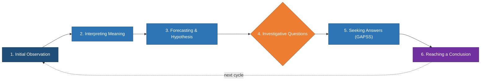
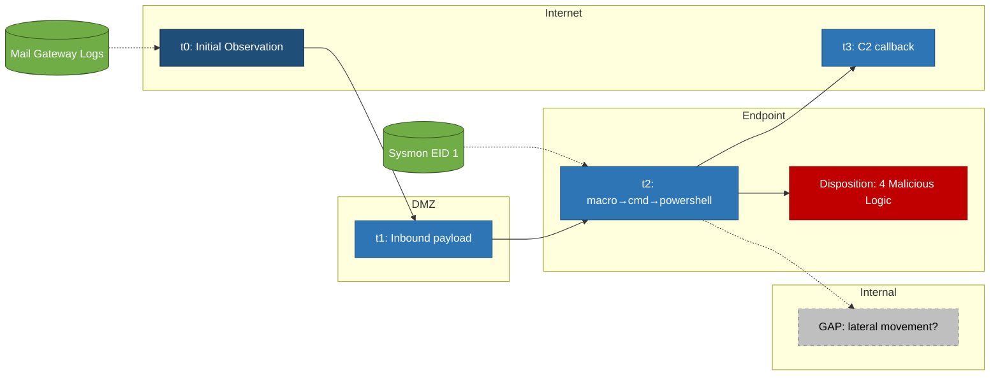
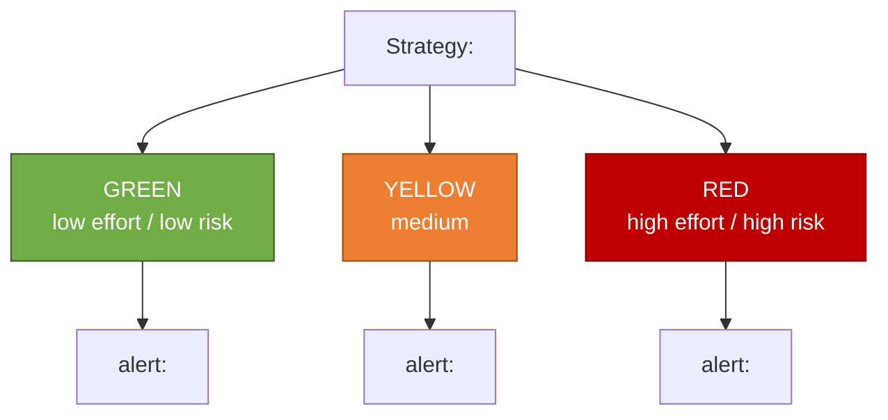
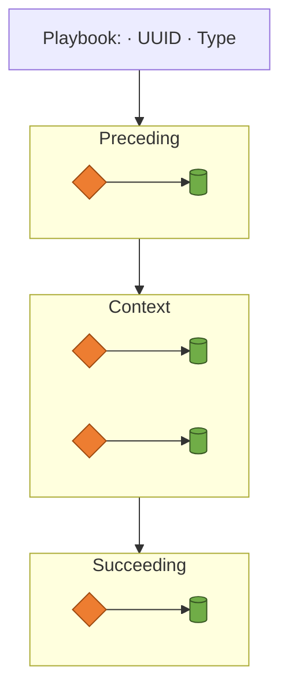
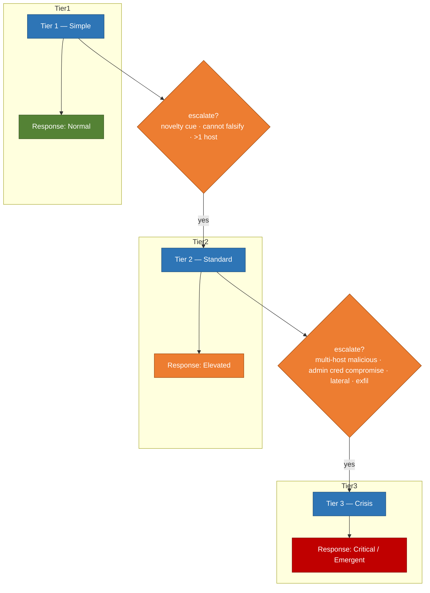

# Diagram Standards — draw.io

Diagrams produced by this skill must be visually identical across analysts and cases. Uniformity is the point: a reader must be able to recognise *which* artifact they are looking at in under two seconds. Never invent new colors, shapes, or layouts — copy the skeletons below and substitute only the labels.

Render diagrams with the `mcp__drawio__open_drawio_xml` tool. If the tool is not available, fall back to the **Mermaid equivalents in §4** of this file — emit the Mermaid code inside a fenced ```` ```mermaid ```` block in chat and tell the user to paste it into Typora, Obsidian, or VS Code with the "Markdown Preview Mermaid Support" extension. Never write `.drawio` XML files to disk as a fallback.

## 1. Fixed style palette (NEVER change)

| Element role | Fill | Stroke | Font color | Shape |
|---|---|---|---|---|
| Start / Observation | `#1F4E79` | `#0B2A44` | `#FFFFFF` | rounded rect |
| Process / Action | `#2E75B6` | `#1F4E79` | `#FFFFFF` | rounded rect |
| Decision / Question | `#ED7D31` | `#9C4A10` | `#FFFFFF` | rhombus |
| Evidence Source | `#70AD47` | `#375623` | `#FFFFFF` | cylinder (`shape=cylinder3`) |
| Conclusion / Disposition | `#7030A0` | `#3B1760` | `#FFFFFF` | rounded rect |
| Malicious outcome | `#C00000` | `#7F0000` | `#FFFFFF` | rounded rect |
| Benign / Explained outcome | `#548235` | `#375623` | `#FFFFFF` | rounded rect |
| Inconclusive / Gap | `#BFBFBF` | `#7F7F7F` | `#000000` | rounded rect (dashed) |
| Functional boundary swimlane | `#F5F7FA` | `#8C8C8C` | `#000000` | swimlane |
| Edge (default) | — | `#595959` | — | orthogonal, 2px |

**Global settings:**
- Font: `Helvetica`, size `12`, labels centered.
- Node size: `160 × 60` for rectangles; `160 × 80` for decisions; `140 × 70` for cylinders.
- Grid: 10px. Snap to grid.
- Page background: white. Dark mode: auto.
- Edge routing: `edgeStyle=orthogonalEdgeStyle;rounded=0;html=1`.

## 2. Standard diagrams

Five and only five diagram types are produced by this skill. If you need something else, make a case for it first, don't improvise.

### 2.1 Diagnostic Inquiry Loop

Six nodes arranged in a circle, clockwise, connected by orthogonal arrows. Label the arrows with short transition verbs. Fixed positions so every rendering looks identical.

Order (clockwise, starting 12 o'clock): Initial Observation → Interpreting Meaning → Forecasting & Hypothesis → Investigative Questions → Seeking Answers → Reaching a Conclusion → (back to Observation for the next cycle).

XML skeleton:

```xml
<mxGraphModel dx="1200" dy="800" grid="1" gridSize="10" guides="1" tooltips="1" connect="1" arrows="1" fold="1" page="1" pageScale="1" pageWidth="1169" pageHeight="826" math="0" shadow="0">
  <root>
    <mxCell id="0"/>
    <mxCell id="1" parent="0"/>
    <mxCell id="t" value="Diagnostic Inquiry Loop" style="text;html=1;align=center;verticalAlign=middle;fontSize=18;fontStyle=1;fontFamily=Helvetica" vertex="1" parent="1"><mxGeometry x="480" y="20" width="260" height="30" as="geometry"/></mxCell>
    <mxCell id="n1" value="1. Initial Observation" style="rounded=1;whiteSpace=wrap;html=1;fillColor=#1F4E79;strokeColor=#0B2A44;fontColor=#FFFFFF;fontFamily=Helvetica;fontSize=12" vertex="1" parent="1"><mxGeometry x="520" y="80"  width="180" height="60" as="geometry"/></mxCell>
    <mxCell id="n2" value="2. Interpreting Meaning" style="rounded=1;whiteSpace=wrap;html=1;fillColor=#2E75B6;strokeColor=#1F4E79;fontColor=#FFFFFF;fontFamily=Helvetica;fontSize=12" vertex="1" parent="1"><mxGeometry x="820" y="220" width="180" height="60" as="geometry"/></mxCell>
    <mxCell id="n3" value="3. Forecasting &amp; Hypothesis" style="rounded=1;whiteSpace=wrap;html=1;fillColor=#2E75B6;strokeColor=#1F4E79;fontColor=#FFFFFF;fontFamily=Helvetica;fontSize=12" vertex="1" parent="1"><mxGeometry x="820" y="440" width="180" height="60" as="geometry"/></mxCell>
    <mxCell id="n4" value="4. Investigative Questions" style="rhombus;whiteSpace=wrap;html=1;fillColor=#ED7D31;strokeColor=#9C4A10;fontColor=#FFFFFF;fontFamily=Helvetica;fontSize=12" vertex="1" parent="1"><mxGeometry x="520" y="560" width="180" height="80" as="geometry"/></mxCell>
    <mxCell id="n5" value="5. Seeking Answers (GAPSS)" style="rounded=1;whiteSpace=wrap;html=1;fillColor=#2E75B6;strokeColor=#1F4E79;fontColor=#FFFFFF;fontFamily=Helvetica;fontSize=12" vertex="1" parent="1"><mxGeometry x="220" y="440" width="180" height="60" as="geometry"/></mxCell>
    <mxCell id="n6" value="6. Reaching a Conclusion" style="rounded=1;whiteSpace=wrap;html=1;fillColor=#7030A0;strokeColor=#3B1760;fontColor=#FFFFFF;fontFamily=Helvetica;fontSize=12" vertex="1" parent="1"><mxGeometry x="220" y="220" width="180" height="60" as="geometry"/></mxCell>
    <mxCell id="e1" style="edgeStyle=orthogonalEdgeStyle;rounded=0;html=1;strokeColor=#595959;strokeWidth=2" edge="1" parent="1" source="n1" target="n2"><mxGeometry relative="1" as="geometry"/></mxCell>
    <mxCell id="e2" style="edgeStyle=orthogonalEdgeStyle;rounded=0;html=1;strokeColor=#595959;strokeWidth=2" edge="1" parent="1" source="n2" target="n3"><mxGeometry relative="1" as="geometry"/></mxCell>
    <mxCell id="e3" style="edgeStyle=orthogonalEdgeStyle;rounded=0;html=1;strokeColor=#595959;strokeWidth=2" edge="1" parent="1" source="n3" target="n4"><mxGeometry relative="1" as="geometry"/></mxCell>
    <mxCell id="e4" style="edgeStyle=orthogonalEdgeStyle;rounded=0;html=1;strokeColor=#595959;strokeWidth=2" edge="1" parent="1" source="n4" target="n5"><mxGeometry relative="1" as="geometry"/></mxCell>
    <mxCell id="e5" style="edgeStyle=orthogonalEdgeStyle;rounded=0;html=1;strokeColor=#595959;strokeWidth=2" edge="1" parent="1" source="n5" target="n6"><mxGeometry relative="1" as="geometry"/></mxCell>
    <mxCell id="e6" value="next cycle" style="edgeStyle=orthogonalEdgeStyle;rounded=0;html=1;strokeColor=#595959;strokeWidth=2;dashed=1;fontFamily=Helvetica;fontSize=10" edge="1" parent="1" source="n6" target="n1"><mxGeometry relative="1" as="geometry"/></mxCell>
  </root>
</mxGraphModel>
```

### 2.2 Attack Timeline with Functional Boundaries

Horizontal swimlanes labelled **Internet**, **DMZ**, **Internal**, **Endpoint** (top to bottom, in that order). Events are chronological left to right. Each event is a rounded rectangle (Process color) placed in the swimlane it occurred in. Evidence sources that produced the event are cylinders (Evidence color) connected by a dashed line. Gaps are dashed gray rectangles labelled `GAP: <question>`.

Layout rules:
- Swimlane height: 140. Total page width: extend as needed, step 200px between events.
- Time axis label at the bottom with arrow pointing right.
- Initial observation node is highlighted with the Start color.
- Final disposition node uses the Malicious / Benign / Inconclusive color according to outcome.

Skeleton (starter — extend by duplicating event blocks):

```xml
<mxGraphModel dx="1600" dy="900" grid="1" gridSize="10" guides="1" tooltips="1" arrows="1" fold="1" page="1" pageScale="1" pageWidth="1600" pageHeight="900">
  <root>
    <mxCell id="0"/><mxCell id="1" parent="0"/>
    <mxCell id="t" value="Attack Timeline — &lt;CASE ID&gt;" style="text;html=1;align=center;fontSize=18;fontStyle=1;fontFamily=Helvetica" vertex="1" parent="1"><mxGeometry x="600" y="10" width="400" height="30" as="geometry"/></mxCell>
    <mxCell id="sw1" value="Internet"  style="swimlane;html=1;startSize=30;horizontal=0;fillColor=#F5F7FA;strokeColor=#8C8C8C;fontFamily=Helvetica;fontSize=12;fontStyle=1" vertex="1" parent="1"><mxGeometry x="40" y="60"  width="1500" height="140" as="geometry"/></mxCell>
    <mxCell id="sw2" value="DMZ"       style="swimlane;html=1;startSize=30;horizontal=0;fillColor=#F5F7FA;strokeColor=#8C8C8C;fontFamily=Helvetica;fontSize=12;fontStyle=1" vertex="1" parent="1"><mxGeometry x="40" y="200" width="1500" height="140" as="geometry"/></mxCell>
    <mxCell id="sw3" value="Internal"  style="swimlane;html=1;startSize=30;horizontal=0;fillColor=#F5F7FA;strokeColor=#8C8C8C;fontFamily=Helvetica;fontSize=12;fontStyle=1" vertex="1" parent="1"><mxGeometry x="40" y="340" width="1500" height="140" as="geometry"/></mxCell>
    <mxCell id="sw4" value="Endpoint"  style="swimlane;html=1;startSize=30;horizontal=0;fillColor=#F5F7FA;strokeColor=#8C8C8C;fontFamily=Helvetica;fontSize=12;fontStyle=1" vertex="1" parent="1"><mxGeometry x="40" y="480" width="1500" height="140" as="geometry"/></mxCell>
    <!-- example event block; duplicate and shift x for each timeline step -->
    <mxCell id="ev1" value="t0: Initial Observation" style="rounded=1;whiteSpace=wrap;html=1;fillColor=#1F4E79;strokeColor=#0B2A44;fontColor=#FFFFFF;fontFamily=Helvetica;fontSize=12" vertex="1" parent="1"><mxGeometry x="120" y="100" width="160" height="60" as="geometry"/></mxCell>
    <mxCell id="ev2" value="t1: Payload delivered" style="rounded=1;whiteSpace=wrap;html=1;fillColor=#2E75B6;strokeColor=#1F4E79;fontColor=#FFFFFF;fontFamily=Helvetica;fontSize=12" vertex="1" parent="1"><mxGeometry x="360" y="520" width="160" height="60" as="geometry"/></mxCell>
    <mxCell id="evs1" value="Mail Gateway Logs" style="shape=cylinder3;whiteSpace=wrap;html=1;fillColor=#70AD47;strokeColor=#375623;fontColor=#FFFFFF;fontFamily=Helvetica;fontSize=11" vertex="1" parent="1"><mxGeometry x="130" y="660" width="140" height="70" as="geometry"/></mxCell>
    <mxCell id="disp" value="Disposition: 4 — Malicious Logic" style="rounded=1;whiteSpace=wrap;html=1;fillColor=#C00000;strokeColor=#7F0000;fontColor=#FFFFFF;fontFamily=Helvetica;fontSize=12;fontStyle=1" vertex="1" parent="1"><mxGeometry x="1340" y="360" width="180" height="60" as="geometry"/></mxCell>
    <mxCell id="tax" value="time →" style="text;html=1;align=center;fontFamily=Helvetica;fontSize=11;fontStyle=2" vertex="1" parent="1"><mxGeometry x="760" y="760" width="80" height="20" as="geometry"/></mxCell>
    <mxCell id="e1" style="edgeStyle=orthogonalEdgeStyle;rounded=0;html=1;strokeColor=#595959;strokeWidth=2" edge="1" parent="1" source="ev1" target="ev2"><mxGeometry relative="1" as="geometry"/></mxCell>
    <mxCell id="e2" style="edgeStyle=orthogonalEdgeStyle;rounded=0;html=1;strokeColor=#595959;strokeWidth=2;dashed=1" edge="1" parent="1" source="evs1" target="ev1"><mxGeometry relative="1" as="geometry"/></mxCell>
  </root>
</mxGraphModel>
```

### 2.3 Triage Decision (Green / Yellow / Red)

Three vertical columns labelled Green, Yellow, Red. Header row names the strategy (Threat-Centric / Risk-Centric / Hybrid). Columns use the exact colors `#70AD47` (Green), `#ED7D31` (Yellow), `#C00000` (Red). Alerts drop in as small rounded rectangles inside the matching column.

### 2.4 Playbook Question Flow

Three grouped columns: **Preceding**, **Context**, **Succeeding**. Each question is a rhombus (Decision color). Each question points to one or more Evidence cylinders below it. The playbook metadata header is a rectangle at the top with the playbook Name, UUID, Type, and linked playbooks.

### 2.5 Tier Escalation Flow

Three stacked lanes: Tier 1 (top), Tier 2 (middle), Tier 3 (bottom). Escalation triggers are decision rhombuses between lanes. Each tier ends with its Response Category (Normal / Elevated / Critical / Emergent) as a colored rectangle.

## 3. Rendering checklist

Before opening a diagram, verify:

- [ ] Uses only colors from the fixed palette.
- [ ] Fonts are Helvetica 12 (title 18 bold).
- [ ] Node sizes match the spec (160×60 / 160×80 / 140×70).
- [ ] Edges are orthogonal, 2px, `#595959`.
- [ ] Title block at the top naming the diagram type and the case ID.
- [ ] Disposition / outcome node uses the correct outcome color.

If any check fails, fix the XML before rendering.

## 4. Mermaid fallback (when `mcp__drawio__open_drawio_xml` is unavailable)

Emit one of the templates below as a fenced ```` ```mermaid ```` block in chat. Substitute the `<placeholders>` with case data. Mermaid's classDef colors mirror the fixed palette as closely as the renderer allows; exact node sizing and orthogonal edge routing are not reproducible, but the topology (stages, swimlanes, columns, queues, lanes) is preserved so the artifact remains recognisable.

Tell the user: *"Paste this into Typora, Obsidian, or VS Code (with the 'Markdown Preview Mermaid Support' extension) to render the diagram."*

### 4.1 Diagnostic Inquiry Loop — Mermaid



### 4.2 Attack Timeline with Functional Boundaries — Mermaid

Mermaid does not render true swimlanes, so use `subgraph` per boundary and chronological left-to-right ordering inside each. Cross-boundary edges represent attacker movement.



### 4.3 Triage Decision (Green / Yellow / Red) — Mermaid



### 4.4 Playbook Question Flow — Mermaid



### 4.5 Tier Escalation Flow — Mermaid


