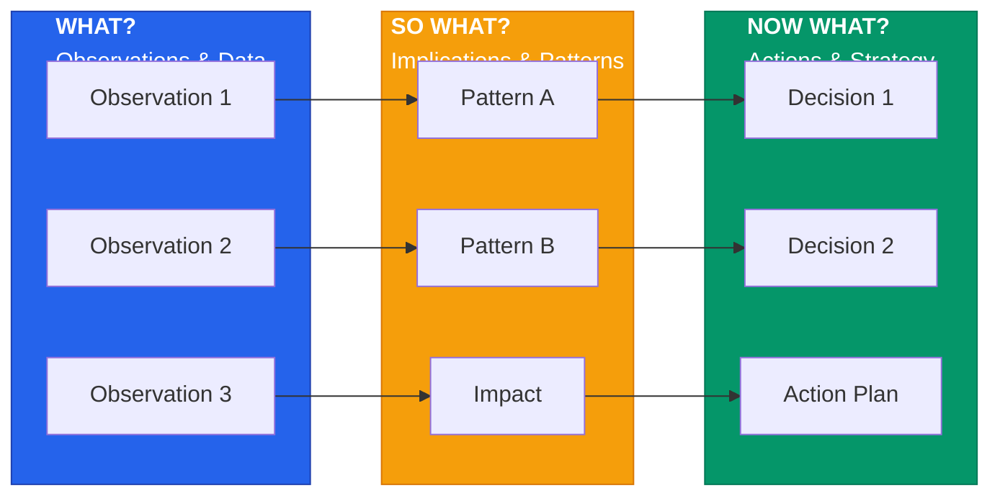

```mermaid
graph LR
    subgraph Past["<b>Past</b><br/>What has shaped us?"]
        P1["Root causes"]
        P2["Historical patterns"]
    end
    
    subgraph Present["<b>Present</b><br/>Where are we now?"]
        PR1["Current state"]
        PR2["Key actors"]
        PR3["Power dynamics"]
    end
    
    subgraph Future["<b>Future</b><br/>Where might we go?"]
        F1["Opportunities"]
        F2["Challenges"]
        F3["Tipping points"]
    end
    
    subgraph Aspiration["<b>Aspiration</b><br/>Where do we want to go?"]
        A1["Desired outcomes"]
        A2["Values"]
    end
    
    Past --> Present
    Present --> Future
    Future --> Aspiration
    
    style Past fill:#64748B,stroke:#334155,color:#fff
    style Present fill:#2563EB,stroke:#1e40af,color:#fff
    style Future fill:#F59E0B,stroke:#d97706,color:#fff
    style Aspiration fill:#059669,stroke:#047857,color:#fff
```

# Strategic Foresight Diagram Templates — draw.io Specifications

## Table of Contents
1. [Global Style Constants](#global-style-constants)
2. [PESTLE/GRNO Multi-Column Matrix](#1-pestlegrno-multi-column-matrix)
3. [Trend Stage Analysis Matrix](#2-trend-stage-analysis-impact--lifecycle-matrix)
4. [Trend Impact Comparison Table](#3-trend-impact-comparison-table)
5. [Cross-Impact Matrix (5×5)](#4-cross-impact-matrix-55)
6. [Perception Analysis Hub-and-Spoke](#5-perception-analysis-hub-and-spoke)
7. [Three Futures Comparison](#6-three-futures-three-column-comparison)
8. [Dator's Four Archetypes](#7-dators-four-archetypes-2x2-quadrant)
9. [Intuitive Logics](#8-intuitive-logics-2x2--strategy-table)
10. [Lum's Four Steps](#9-lums-four-steps-sequential-process-flow)
11. [Futures Cone](#10-futures-cone-concentric-arcs)
12. [VUCA Assessment Matrix](#11-vuca-scored-assessment-matrix)
13. [CATUR Assessment Matrix](#12-catur-scored-assessment-matrix)
14. [What If/Then Cross-Impact](#13-what-ifthen-cross-impact-table)
15. [Layered Timeline](#14-layered-timeline-swimlane)
16. [What/So What/Now What](#15-whatsowhatnow-what-process-flow)
17. [Weak Signal Comparison](#16-weak-signal-comparison-table)
18. [Analogical Reasoning](#17-analogical-reasoning-two-column-comparison)
19. [Macro/Meso/Micro Matrix](#18-macromesomicro-three-row-matrix)
20. [Stakeholder Analysis](#19-stakeholder-analysis-matrix)
21. [Consequence Analysis](#20-consequence-analysis-table)

---

## Global Style Constants

### Colors (Hex)
```
BACKGROUND    = #F8FAFC
WHITE         = #FFFFFF
BORDER        = #334155
TEXT          = #334155
TEXT_SECONDARY = #64748B
ACCENT        = #2563EB
ACCENT_LIGHT  = #DBEAFE
SUPPORTING    = #059669
SUPPORT_LIGHT = #D1FAE5
WARNING       = #F59E0B
WARN_LIGHT    = #FFFBEB
CRITICAL      = #DC2626
CRIT_LIGHT    = #FEE2E2
NEUTRAL       = #64748B
NEUTRAL_LIGHT = #F1F5F9
HIGHLIGHT     = #8B5CF6
HIGHLIGHT_LIGHT = #EDE9FE
GRID_LINE     = #CBD5E1
AXIS_LINE     = #94A3B8
```

### Typography (Font Sizes in pt)
```
TITLE_SIZE    = 16
SUBTITLE_SIZE = 11
HEADER_SIZE   = 13
ITEM_SIZE     = 10
DETAIL_SIZE   = 9
LEGEND_SIZE   = 9
```

### Common XML Style Strings

#### Text Styles
```
TITLE_STYLE = "text;html=1;align=center;verticalAlign=middle;whiteSpace=wrap;fontSize=16;fontColor=#334155;fontStyle=1;"

SUBTITLE_STYLE = "text;html=1;align=center;verticalAlign=middle;whiteSpace=wrap;fontSize=11;fontColor=#64748B;"

LEGEND_TITLE = "text;html=1;align=left;fontSize=10;fontColor=#334155;fontStyle=1;"

LEGEND_LABEL = "text;html=1;align=left;fontSize=9;fontColor=#334155;verticalAlign=middle;"

LEGEND_DOT_TEMPLATE = "ellipse;html=1;rounded=1;fillColor=[COLOR];strokeColor=none;fontSize=1;" (width=12, height=12)

AXIS_LABEL = "text;html=1;align=center;fontSize=10;fontColor=#334155;fontStyle=1;"

DASHED_LINE = "endArrow=none;dashed=1;strokeColor=#94A3B8;strokeWidth=2;"

SOLID_CONNECTOR = "edgeStyle=orthogonalEdgeStyle;rounded=0;orthogonalLoop=1;jettySize=auto;html=1;strokeColor=#CBD5E1;strokeWidth=1;"

OUTER_BORDER = "rounded=0;whiteSpace=wrap;html=1;fillColor=none;strokeColor=#CBD5E1;strokeWidth=1;"
```

#### Node Styles
```
ITEM_NODE_TEMPLATE = "rounded=1;whiteSpace=wrap;html=1;fontSize=10;shadow=1;align=left;verticalAlign=middle;spacingLeft=8;spacingRight=8;fillColor=[FILL];fontColor=[FONT];strokeColor=[BORDER];"

HEADER_NODE_TEMPLATE = "rounded=1;whiteSpace=wrap;html=1;fontSize=13;verticalAlign=middle;shadow=1;fontColor=#FFFFFF;align=center;fillColor=[FILL];strokeColor=[STROKE];"

CELL_TEMPLATE = "rounded=0;whiteSpace=wrap;html=1;fontSize=10;align=left;verticalAlign=top;fillColor=#FFFFFF;strokeColor=#CBD5E1;strokeWidth=1;padding=4;"

SECTION_HEADER_TEMPLATE = "rounded=0;whiteSpace=wrap;html=1;fontSize=10;align=center;verticalAlign=middle;fillColor=[FILL];fontColor=#FFFFFF;strokeColor=[STROKE];fontStyle=1;"

QUADRANT_TEMPLATE = "rounded=0;whiteSpace=wrap;html=1;fillColor=[FILL];strokeColor=#94A3B8;strokeWidth=2;opacity=30;"

ACCENT_BOX = "rounded=1;whiteSpace=wrap;html=1;fillColor=[FILL];strokeColor=[BORDER];strokeWidth=2;"
```

---

## 1. PESTLE/GRNO Multi-Column Matrix

### Specifications

**Canvas Size:** 1200 × 600

**Layout Structure:**
- Title area: y=10, height=30
- Grid starts: y=50
- 6 columns (Political, Economic, Socio-Cultural, Technological, Legal, Environmental)
- N rows of data (typically 2: Trends + Events)

**Spatial Coordinates:**

| Element | X | Y | Width | Height | Notes |
|---------|---|---|-------|--------|-------|
| Title | 30 | 10 | 1140 | 30 | Center-aligned, fontSize=16 |
| Column Header (each) | 30+(col*185) | 50 | 175 | 40 | PESTLE labels |
| Row Header (each) | 10 | 95+(row*80) | 20 | 75 | Rotated text or side-label |
| Data Cell (each) | 30+(col*185) | 95+(row*80) | 175 | 75 | Text wrapping |

**Scaling Rules:**
- Add 80px per additional row below row height formula
- Column width fixed at 175px
- Total width for 6 columns: 1050px + 30px margin + 120px buffer = 1200px

**Element Styles:**

```
Column Headers:
  fillColor: #2563EB
  fontColor: #FFFFFF
  fontSize: 11
  fontStyle: 1 (bold)
  align: center
  verticalAlign: middle

Row Headers:
  fillColor: #F1F5F9
  fontColor: #334155
  fontSize: 10
  fontStyle: 1
  align: center
  verticalAlign: middle

Data Cells:
  fillColor: #FFFFFF
  strokeColor: #CBD5E1
  strokeWidth: 1
  fontSize: 9
  align: left
  verticalAlign: top
  whiteSpace: wrap
  padding: 4
```

**Complete XML Example:**

```xml
<?xml version="1.0" encoding="UTF-8"?>
<mxGraphModel dx="1200" dy="600" grid="1" gridSize="10" guides="1" tooltips="1" connect="1" arrows="1" fold="1" page="1" pageScale="1" pageWidth="1200" pageHeight="600" background="#F8FAFC" math="0" shadow="0">
  <root>
    <mxCell id="0" />
    <mxCell id="1" parent="0" />
    
    <!-- Title -->
    <mxCell id="title" value="PESTLE Analysis" style="text;html=1;align=center;verticalAlign=middle;whiteSpace=wrap;fontSize=16;fontColor=#334155;fontStyle=1;" vertex="1" parent="1">
      <mxGeometry x="30" y="10" width="1140" height="30" as="geometry" />
    </mxCell>
    
    <!-- Column Headers: P, E, S, T, L, E -->
    <mxCell id="h_political" value="Political" style="rounded=1;whiteSpace=wrap;html=1;fontSize=11;verticalAlign=middle;shadow=1;fontColor=#FFFFFF;align=center;fillColor=#2563EB;strokeColor=#1e40af;" vertex="1" parent="1">
      <mxGeometry x="30" y="50" width="175" height="40" as="geometry" />
    </mxCell>
    <mxCell id="h_economic" value="Economic" style="rounded=1;whiteSpace=wrap;html=1;fontSize=11;verticalAlign=middle;shadow=1;fontColor=#FFFFFF;align=center;fillColor=#2563EB;strokeColor=#1e40af;" vertex="1" parent="1">
      <mxGeometry x="215" y="50" width="175" height="40" as="geometry" />
    </mxCell>
    <mxCell id="h_social" value="Socio-Cultural" style="rounded=1;whiteSpace=wrap;html=1;fontSize=11;verticalAlign=middle;shadow=1;fontColor=#FFFFFF;align=center;fillColor=#2563EB;strokeColor=#1e40af;" vertex="1" parent="1">
      <mxGeometry x="400" y="50" width="175" height="40" as="geometry" />
    </mxCell>
    <mxCell id="h_tech" value="Technological" style="rounded=1;whiteSpace=wrap;html=1;fontSize=11;verticalAlign=middle;shadow=1;fontColor=#FFFFFF;align=center;fillColor=#2563EB;strokeColor=#1e40af;" vertex="1" parent="1">
      <mxGeometry x="585" y="50" width="175" height="40" as="geometry" />
    </mxCell>
    <mxCell id="h_legal" value="Legal" style="rounded=1;whiteSpace=wrap;html=1;fontSize=11;verticalAlign=middle;shadow=1;fontColor=#FFFFFF;align=center;fillColor=#2563EB;strokeColor=#1e40af;" vertex="1" parent="1">
      <mxGeometry x="770" y="50" width="175" height="40" as="geometry" />
    </mxCell>
    <mxCell id="h_environ" value="Environmental" style="rounded=1;whiteSpace=wrap;html=1;fontSize=11;verticalAlign=middle;shadow=1;fontColor=#FFFFFF;align=center;fillColor=#2563EB;strokeColor=#1e40af;" vertex="1" parent="1">
      <mxGeometry x="955" y="50" width="175" height="40" as="geometry" />
    </mxCell>
    
    <!-- Row Header: Trends -->
    <mxCell id="rh_trends" value="Trends" style="rounded=1;whiteSpace=wrap;html=1;fontSize=10;verticalAlign=middle;shadow=1;fontColor=#334155;align=center;fillColor=#F1F5F9;strokeColor=#CBD5E1;" vertex="1" parent="1">
      <mxGeometry x="10" y="95" width="15" height="75" as="geometry" />
    </mxCell>
    
    <!-- Data Cells Row 1 (Trends) -->
    <mxCell id="c1_1" value="Government policy shifts" style="rounded=0;whiteSpace=wrap;html=1;fontSize=9;align=left;verticalAlign=top;fillColor=#FFFFFF;strokeColor=#CBD5E1;strokeWidth=1;padding=4;" vertex="1" parent="1">
      <mxGeometry x="30" y="95" width="175" height="75" as="geometry" />
    </mxCell>
    <mxCell id="c1_2" value="Market volatility &amp; inflation trends" style="rounded=0;whiteSpace=wrap;html=1;fontSize=9;align=left;verticalAlign=top;fillColor=#FFFFFF;strokeColor=#CBD5E1;strokeWidth=1;padding=4;" vertex="1" parent="1">
      <mxGeometry x="215" y="95" width="175" height="75" as="geometry" />
    </mxCell>
    <mxCell id="c1_3" value="Demographic changes &amp; migration patterns" style="rounded=0;whiteSpace=wrap;html=1;fontSize=9;align=left;verticalAlign=top;fillColor=#FFFFFF;strokeColor=#CBD5E1;strokeWidth=1;padding=4;" vertex="1" parent="1">
      <mxGeometry x="400" y="95" width="175" height="75" as="geometry" />
    </mxCell>
    <mxCell id="c1_4" value="AI &amp; automation adoption" style="rounded=0;whiteSpace=wrap;html=1;fontSize=9;align=left;verticalAlign=top;fillColor=#FFFFFF;strokeColor=#CBD5E1;strokeWidth=1;padding=4;" vertex="1" parent="1">
      <mxGeometry x="585" y="95" width="175" height="75" as="geometry" />
    </mxCell>
    <mxCell id="c1_5" value="Regulatory framework evolution" style="rounded=0;whiteSpace=wrap;html=1;fontSize=9;align=left;verticalAlign=top;fillColor=#FFFFFF;strokeColor=#CBD5E1;strokeWidth=1;padding=4;" vertex="1" parent="1">
      <mxGeometry x="770" y="95" width="175" height="75" as="geometry" />
    </mxCell>
    <mxCell id="c1_6" value="Climate policy acceleration" style="rounded=0;whiteSpace=wrap;html=1;fontSize=9;align=left;verticalAlign=top;fillColor=#FFFFFF;strokeColor=#CBD5E1;strokeWidth=1;padding=4;" vertex="1" parent="1">
      <mxGeometry x="955" y="95" width="175" height="75" as="geometry" />
    </mxCell>
    
    <!-- Row Header: Events -->
    <mxCell id="rh_events" value="Events" style="rounded=1;whiteSpace=wrap;html=1;fontSize=10;verticalAlign=middle;shadow=1;fontColor=#334155;align=center;fillColor=#F1F5F9;strokeColor=#CBD5E1;" vertex="1" parent="1">
      <mxGeometry x="10" y="175" width="15" height="75" as="geometry" />
    </mxCell>
    
    <!-- Data Cells Row 2 (Events) -->
    <mxCell id="c2_1" value="Election cycles, policy announcements" style="rounded=0;whiteSpace=wrap;html=1;fontSize=9;align=left;verticalAlign=top;fillColor=#FFFFFF;strokeColor=#CBD5E1;strokeWidth=1;padding=4;" vertex="1" parent="1">
      <mxGeometry x="30" y="175" width="175" height="75" as="geometry" />
    </mxCell>
    <mxCell id="c2_2" value="Commodity price shocks, recession signals" style="rounded=0;whiteSpace=wrap;html=1;fontSize=9;align=left;verticalAlign=top;fillColor=#FFFFFF;strokeColor=#CBD5E1;strokeWidth=1;padding=4;" vertex="1" parent="1">
      <mxGeometry x="215" y="175" width="175" height="75" as="geometry" />
    </mxCell>
    <mxCell id="c2_3" value="Social movements, cultural shifts" style="rounded=0;whiteSpace=wrap;html=1;fontSize=9;align=left;verticalAlign=top;fillColor=#FFFFFF;strokeColor=#CBD5E1;strokeWidth=1;padding=4;" vertex="1" parent="1">
      <mxGeometry x="400" y="175" width="175" height="75" as="geometry" />
    </mxCell>
    <mxCell id="c2_4" value="Breakthrough innovations &amp; deployments" style="rounded=0;whiteSpace=wrap;html=1;fontSize=9;align=left;verticalAlign=top;fillColor=#FFFFFF;strokeColor=#CBD5E1;strokeWidth=1;padding=4;" vertex="1" parent="1">
      <mxGeometry x="585" y="175" width="175" height="75" as="geometry" />
    </mxCell>
    <mxCell id="c2_5" value="Law changes, court rulings, compliance deadlines" style="rounded=0;whiteSpace=wrap;html=1;fontSize=9;align=left;verticalAlign=top;fillColor=#FFFFFF;strokeColor=#CBD5E1;strokeWidth=1;padding=4;" vertex="1" parent="1">
      <mxGeometry x="770" y="175" width="175" height="75" as="geometry" />
    </mxCell>
    <mxCell id="c2_6" value="Extreme weather, COP summits, net-zero commitments" style="rounded=0;whiteSpace=wrap;html=1;fontSize=9;align=left;verticalAlign=top;fillColor=#FFFFFF;strokeColor=#CBD5E1;strokeWidth=1;padding=4;" vertex="1" parent="1">
      <mxGeometry x="955" y="175" width="175" height="75" as="geometry" />
    </mxCell>
    
  </root>
</mxGraphModel>
```

---

## 2. Trend Stage Analysis (Impact × Lifecycle Matrix)

### Specifications

**Canvas Size:** 1000 × 700

**Grid Structure:**
- X-axis (Lifecycle): Latent (x=160), Emerging (x=360), Current (x=560), Established (x=760)
- Y-axis (Impact): High (y=120), Medium (y=320), Low (y=520)
- Cell dimensions: 180 × 180px each
- Grid lines: dashed, strokeColor=#CBD5E1

**Spatial Coordinates:**

| Element | X | Y | Width | Height |
|---------|---|---|-------|--------|
| Title | 50 | 10 | 900 | 30 |
| Y-axis label "High" | 20 | 120 | 40 | 20 |
| Y-axis label "Medium" | 20 | 320 | 40 | 20 |
| Y-axis label "Low" | 20 | 520 | 40 | 20 |
| X-axis label "Latent" | 140 | 620 | 40 | 20 |
| X-axis label "Emerging" | 340 | 620 | 40 | 20 |
| X-axis label "Current" | 540 | 620 | 40 | 20 |
| X-axis label "Established" | 740 | 620 | 40 | 20 |

**Trend Item Node Styles:**
- Width: 140px, Height: 40px
- Lifecycle-based colors:
  - Latent: #8B5CF6 (highlight purple)
  - Emerging: #F59E0B (warning amber)
  - Current: #2563EB (accent blue)
  - Established: #64748B (neutral gray)

**Example with 2 Trends:**

```xml
<?xml version="1.0" encoding="UTF-8"?>
<mxGraphModel dx="1000" dy="700" grid="1" gridSize="10" guides="1" tooltips="1" connect="1" arrows="1" fold="1" page="1" pageScale="1" pageWidth="1000" pageHeight="700" background="#F8FAFC" math="0" shadow="0">
  <root>
    <mxCell id="0" />
    <mxCell id="1" parent="0" />
    
    <!-- Title -->
    <mxCell id="title" value="Trend Stage Analysis: Impact × Lifecycle" style="text;html=1;align=center;verticalAlign=middle;whiteSpace=wrap;fontSize=16;fontColor=#334155;fontStyle=1;" vertex="1" parent="1">
      <mxGeometry x="50" y="10" width="900" height="30" as="geometry" />
    </mxCell>
    
    <!-- Y-axis labels -->
    <mxCell id="ylab_high" value="High Impact" style="text;html=1;align=right;fontSize=10;fontColor=#334155;fontStyle=1;" vertex="1" parent="1">
      <mxGeometry x="20" y="120" width="50" height="20" as="geometry" />
    </mxCell>
    <mxCell id="ylab_med" value="Medium Impact" style="text;html=1;align=right;fontSize=10;fontColor=#334155;fontStyle=1;" vertex="1" parent="1">
      <mxGeometry x="20" y="320" width="50" height="20" as="geometry" />
    </mxCell>
    <mxCell id="ylab_low" value="Low Impact" style="text;html=1;align=right;fontSize=10;fontColor=#334155;fontStyle=1;" vertex="1" parent="1">
      <mxGeometry x="20" y="520" width="50" height="20" as="geometry" />
    </mxCell>
    
    <!-- X-axis labels -->
    <mxCell id="xlab_latent" value="Latent" style="text;html=1;align=center;fontSize=10;fontColor=#334155;fontStyle=1;" vertex="1" parent="1">
      <mxGeometry x="140" y="620" width="40" height="20" as="geometry" />
    </mxCell>
    <mxCell id="xlab_emerging" value="Emerging" style="text;html=1;align=center;fontSize=10;fontColor=#334155;fontStyle=1;" vertex="1" parent="1">
      <mxGeometry x="340" y="620" width="40" height="20" as="geometry" />
    </mxCell>
    <mxCell id="xlab_current" value="Current" style="text;html=1;align=center;fontSize=10;fontColor=#334155;fontStyle=1;" vertex="1" parent="1">
      <mxGeometry x="540" y="620" width="40" height="20" as="geometry" />
    </mxCell>
    <mxCell id="xlab_established" value="Established" style="text;html=1;align=center;fontSize=10;fontColor=#334155;fontStyle=1;" vertex="1" parent="1">
      <mxGeometry x="740" y="620" width="40" height="20" as="geometry" />
    </mxCell>
    
    <!-- Grid cells with dashed borders -->
    <!-- High-Impact row -->
    <mxCell id="grid_h_latent" value="" style="rounded=0;whiteSpace=wrap;html=1;fillColor=none;strokeColor=#CBD5E1;strokeWidth=1;dashed=1;" vertex="1" parent="1">
      <mxGeometry x="100" y="100" width="180" height="180" as="geometry" />
    </mxCell>
    <mxCell id="grid_h_emerging" value="" style="rounded=0;whiteSpace=wrap;html=1;fillColor=none;strokeColor=#CBD5E1;strokeWidth=1;dashed=1;" vertex="1" parent="1">
      <mxGeometry x="300" y="100" width="180" height="180" as="geometry" />
    </mxCell>
    <mxCell id="grid_h_current" value="" style="rounded=0;whiteSpace=wrap;html=1;fillColor=none;strokeColor=#CBD5E1;strokeWidth=1;dashed=1;" vertex="1" parent="1">
      <mxGeometry x="500" y="100" width="180" height="180" as="geometry" />
    </mxCell>
    <mxCell id="grid_h_established" value="" style="rounded=0;whiteSpace=wrap;html=1;fillColor=none;strokeColor=#CBD5E1;strokeWidth=1;dashed=1;" vertex="1" parent="1">
      <mxGeometry x="700" y="100" width="180" height="180" as="geometry" />
    </mxCell>
    
    <!-- Medium-Impact row -->
    <mxCell id="grid_m_latent" value="" style="rounded=0;whiteSpace=wrap;html=1;fillColor=none;strokeColor=#CBD5E1;strokeWidth=1;dashed=1;" vertex="1" parent="1">
      <mxGeometry x="100" y="300" width="180" height="180" as="geometry" />
    </mxCell>
    <mxCell id="grid_m_emerging" value="" style="rounded=0;whiteSpace=wrap;html=1;fillColor=none;strokeColor=#CBD5E1;strokeWidth=1;dashed=1;" vertex="1" parent="1">
      <mxGeometry x="300" y="300" width="180" height="180" as="geometry" />
    </mxCell>
    <mxCell id="grid_m_current" value="" style="rounded=0;whiteSpace=wrap;html=1;fillColor=none;strokeColor=#CBD5E1;strokeWidth=1;dashed=1;" vertex="1" parent="1">
      <mxGeometry x="500" y="300" width="180" height="180" as="geometry" />
    </mxCell>
    <mxCell id="grid_m_established" value="" style="rounded=0;whiteSpace=wrap;html=1;fillColor=none;strokeColor=#CBD5E1;strokeWidth=1;dashed=1;" vertex="1" parent="1">
      <mxGeometry x="700" y="300" width="180" height="180" as="geometry" />
    </mxCell>
    
    <!-- Low-Impact row -->
    <mxCell id="grid_l_latent" value="" style="rounded=0;whiteSpace=wrap;html=1;fillColor=none;strokeColor=#CBD5E1;strokeWidth=1;dashed=1;" vertex="1" parent="1">
      <mxGeometry x="100" y="500" width="180" height="180" as="geometry" />
    </mxCell>
    <mxCell id="grid_l_emerging" value="" style="rounded=0;whiteSpace=wrap;html=1;fillColor=none;strokeColor=#CBD5E1;strokeWidth=1;dashed=1;" vertex="1" parent="1">
      <mxGeometry x="300" y="500" width="180" height="180" as="geometry" />
    </mxCell>
    <mxCell id="grid_l_current" value="" style="rounded=0;whiteSpace=wrap;html=1;fillColor=none;strokeColor=#CBD5E1;strokeWidth=1;dashed=1;" vertex="1" parent="1">
      <mxGeometry x="500" y="500" width="180" height="180" as="geometry" />
    </mxCell>
    <mxCell id="grid_l_established" value="" style="rounded=0;whiteSpace=wrap;html=1;fillColor=none;strokeColor=#CBD5E1;strokeWidth=1;dashed=1;" vertex="1" parent="1">
      <mxGeometry x="700" y="500" width="180" height="180" as="geometry" />
    </mxCell>
    
    <!-- Trend items -->
    <!-- Trend 1: Latent + High Impact -->
    <mxCell id="trend_1" value="Quantum computing" style="rounded=1;whiteSpace=wrap;html=1;fontSize=10;shadow=1;align=center;verticalAlign=middle;fillColor=#8B5CF6;fontColor=#FFFFFF;strokeColor=#6D28D9;" vertex="1" parent="1">
      <mxGeometry x="130" y="160" width="140" height="40" as="geometry" />
    </mxCell>
    
    <!-- Trend 2: Current + Medium Impact -->
    <mxCell id="trend_2" value="Remote work adoption" style="rounded=1;whiteSpace=wrap;html=1;fontSize=10;shadow=1;align=center;verticalAlign=middle;fillColor=#2563EB;fontColor=#FFFFFF;strokeColor=#1e40af;" vertex="1" parent="1">
      <mxGeometry x="530" y="360" width="140" height="40" as="geometry" />
    </mxCell>
    
    <!-- Legend -->
    <mxCell id="legend_title" value="Lifecycle Stages:" style="text;html=1;align=left;fontSize=10;fontColor=#334155;fontStyle=1;" vertex="1" parent="1">
      <mxGeometry x="50" y="670" width="150" height="20" as="geometry" />
    </mxCell>
    <mxCell id="legend_latent_dot" value="" style="ellipse;html=1;fillColor=#8B5CF6;strokeColor=none;" vertex="1" parent="1">
      <mxGeometry x="210" y="672" width="12" height="12" as="geometry" />
    </mxCell>
    <mxCell id="legend_latent_label" value="Latent" style="text;html=1;align=left;fontSize=9;fontColor=#334155;" vertex="1" parent="1">
      <mxGeometry x="226" y="670" width="40" height="16" as="geometry" />
    </mxCell>
    <mxCell id="legend_emerging_dot" value="" style="ellipse;html=1;fillColor=#F59E0B;strokeColor=none;" vertex="1" parent="1">
      <mxGeometry x="280" y="672" width="12" height="12" as="geometry" />
    </mxCell>
    <mxCell id="legend_emerging_label" value="Emerging" style="text;html=1;align=left;fontSize=9;fontColor=#334155;" vertex="1" parent="1">
      <mxGeometry x="296" y="670" width="50" height="16" as="geometry" />
    </mxCell>
    <mxCell id="legend_current_dot" value="" style="ellipse;html=1;fillColor=#2563EB;strokeColor=none;" vertex="1" parent="1">
      <mxGeometry x="360" y="672" width="12" height="12" as="geometry" />
    </mxCell>
    <mxCell id="legend_current_label" value="Current" style="text;html=1;align=left;fontSize=9;fontColor=#334155;" vertex="1" parent="1">
      <mxGeometry x="376" y="670" width="40" height="16" as="geometry" />
    </mxCell>
    <mxCell id="legend_estab_dot" value="" style="ellipse;html=1;fillColor=#64748B;strokeColor=none;" vertex="1" parent="1">
      <mxGeometry x="430" y="672" width="12" height="12" as="geometry" />
    </mxCell>
    <mxCell id="legend_estab_label" value="Established" style="text;html=1;align=left;fontSize=9;fontColor=#334155;" vertex="1" parent="1">
      <mxGeometry x="446" y="670" width="60" height="16" as="geometry" />
    </mxCell>
    
  </root>
</mxGraphModel>
```

---

## 3. Trend Impact Comparison Table

### Specifications

**Canvas Size:** 1100 × 500

**Layout:**
- Title: y=10, height=30
- Header row: y=45, height=35
- Data rows: y=85, repeated every 80px
- Supports 4–5 data rows by default

**Column Structure:**

| Column | X | Width | Purpose |
|--------|---|-------|---------|
| Trend Name | 30 | 220 | Trend identifier |
| Impact 1 | 260 | 210 | Variable header (e.g., "Economic", "Regulatory", "Social") |
| Impact 2 | 480 | 210 | Variable header |
| Impact 3 | 700 | 210 | Variable header |
| Impact 4 | 920 | 150 | Variable header (optional; if 5th column, reduce widths proportionally) |

**Header Row Style:**
```
fillColor: #334155
fontColor: #FFFFFF
fontSize: 11
fontStyle: 1
align: center
verticalAlign: middle
```

**Data Cell Style:**
```
fillColor: #FFFFFF
strokeColor: #CBD5E1
strokeWidth: 1
fontSize: 10
align: left
verticalAlign: top
whiteSpace: wrap
padding: 6
```

**Scaling Rules:**
- Add 80px per additional data row
- Column widths adjust proportionally if more than 4 impact columns

**Complete XML Example (Layered Impact variant):**

```xml
<?xml version="1.0" encoding="UTF-8"?>
<mxGraphModel dx="1100" dy="500" grid="1" gridSize="10" guides="1" tooltips="1" connect="1" arrows="1" fold="1" page="1" pageScale="1" pageWidth="1100" pageHeight="500" background="#F8FAFC" math="0" shadow="0">
  <root>
    <mxCell id="0" />
    <mxCell id="1" parent="0" />
    
    <!-- Title -->
    <mxCell id="title" value="Trend Impact Comparison" style="text;html=1;align=center;verticalAlign=middle;whiteSpace=wrap;fontSize=16;fontColor=#334155;fontStyle=1;" vertex="1" parent="1">
      <mxGeometry x="30" y="10" width="1040" height="30" as="geometry" />
    </mxCell>
    
    <!-- Header Row -->
    <mxCell id="h_trend" value="Trend" style="rounded=0;whiteSpace=wrap;html=1;fontSize=11;align=center;verticalAlign=middle;fillColor=#334155;fontColor=#FFFFFF;strokeColor=#1f2937;fontStyle=1;" vertex="1" parent="1">
      <mxGeometry x="30" y="45" width="220" height="35" as="geometry" />
    </mxCell>
    <mxCell id="h_econ" value="Economic Impact" style="rounded=0;whiteSpace=wrap;html=1;fontSize=11;align=center;verticalAlign=middle;fillColor=#334155;fontColor=#FFFFFF;strokeColor=#1f2937;fontStyle=1;" vertex="1" parent="1">
      <mxGeometry x="260" y="45" width="210" height="35" as="geometry" />
    </mxCell>
    <mxCell id="h_social" value="Social Impact" style="rounded=0;whiteSpace=wrap;html=1;fontSize=11;align=center;verticalAlign=middle;fillColor=#334155;fontColor=#FFFFFF;strokeColor=#1f2937;fontStyle=1;" vertex="1" parent="1">
      <mxGeometry x="480" y="45" width="210" height="35" as="geometry" />
    </mxCell>
    <mxCell id="h_tech" value="Technology Impact" style="rounded=0;whiteSpace=wrap;html=1;fontSize=11;align=center;verticalAlign=middle;fillColor=#334155;fontColor=#FFFFFF;strokeColor=#1f2937;fontStyle=1;" vertex="1" parent="1">
      <mxGeometry x="700" y="45" width="210" height="35" as="geometry" />
    </mxCell>
    <mxCell id="h_policy" value="Policy Impact" style="rounded=0;whiteSpace=wrap;html=1;fontSize=11;align=center;verticalAlign=middle;fillColor=#334155;fontColor=#FFFFFF;strokeColor=#1f2937;fontStyle=1;" vertex="1" parent="1">
      <mxGeometry x="920" y="45" width="150" height="35" as="geometry" />
    </mxCell>
    
    <!-- Data Row 1 -->
    <mxCell id="d1_trend" value="AI Automation" style="rounded=0;whiteSpace=wrap;html=1;fontSize=10;align=left;verticalAlign=top;fillColor=#FFFFFF;strokeColor=#CBD5E1;strokeWidth=1;padding=6;" vertex="1" parent="1">
      <mxGeometry x="30" y="85" width="220" height="75" as="geometry" />
    </mxCell>
    <mxCell id="d1_econ" value="Job displacement in routine roles; demand for new skills; productivity gains offset by transition costs" style="rounded=0;whiteSpace=wrap;html=1;fontSize=10;align=left;verticalAlign=top;fillColor=#FFFFFF;strokeColor=#CBD5E1;strokeWidth=1;padding=6;" vertex="1" parent="1">
      <mxGeometry x="260" y="85" width="210" height="75" as="geometry" />
    </mxCell>
    <mxCell id="d1_social" value="Widening inequality gap; shifts in work identity; increased mental health concerns; upskilling demand" style="rounded=0;whiteSpace=wrap;html=1;fontSize=10;align=left;verticalAlign=top;fillColor=#FFFFFF;strokeColor=#CBD5E1;strokeWidth=1;padding=6;" vertex="1" parent="1">
      <mxGeometry x="480" y="85" width="210" height="75" as="geometry" />
    </mxCell>
    <mxCell id="d1_tech" value="Rapid advancement in ML/AI; increased computing demands; cybersecurity complexity grows" style="rounded=0;whiteSpace=wrap;html=1;fontSize=10;align=left;verticalAlign=top;fillColor=#FFFFFF;strokeColor=#CBD5E1;strokeWidth=1;padding=6;" vertex="1" parent="1">
      <mxGeometry x="700" y="85" width="210" height="75" as="geometry" />
    </mxCell>
    <mxCell id="d1_policy" value="Regulation pressure on AI; labor law reform; liability frameworks uncertain" style="rounded=0;whiteSpace=wrap;html=1;fontSize=10;align=left;verticalAlign=top;fillColor=#FFFFFF;strokeColor=#CBD5E1;strokeWidth=1;padding=6;" vertex="1" parent="1">
      <mxGeometry x="920" y="85" width="150" height="75" as="geometry" />
    </mxCell>
    
    <!-- Data Row 2 -->
    <mxCell id="d2_trend" value="Climate Adaptation" style="rounded=0;whiteSpace=wrap;html=1;fontSize=10;align=left;verticalAlign=top;fillColor=#FFFFFF;strokeColor=#CBD5E1;strokeWidth=1;padding=6;" vertex="1" parent="1">
      <mxGeometry x="30" y="165" width="220" height="75" as="geometry" />
    </mxCell>
    <mxCell id="d2_econ" value="Green investment boom; stranded assets in carbon-heavy sectors; supply chain resilience costs" style="rounded=0;whiteSpace=wrap;html=1;fontSize=10;align=left;verticalAlign=top;fillColor=#FFFFFF;strokeColor=#CBD5E1;strokeWidth=1;padding=6;" vertex="1" parent="1">
      <mxGeometry x="260" y="165" width="210" height="75" as="geometry" />
    </mxCell>
    <mxCell id="d2_social" value="Migration pressures; health impacts from air/water quality; food security concerns; equity issues" style="rounded=0;whiteSpace=wrap;html=1;fontSize=10;align=left;verticalAlign=top;fillColor=#FFFFFF;strokeColor=#CBD5E1;strokeWidth=1;padding=6;" vertex="1" parent="1">
      <mxGeometry x="480" y="165" width="210" height="75" as="geometry" />
    </mxCell>
    <mxCell id="d2_tech" value="Green tech innovation; renewable energy scale-up; carbon capture R&D acceleration" style="rounded=0;whiteSpace=wrap;html=1;fontSize=10;align=left;verticalAlign=top;fillColor=#FFFFFF;strokeColor#CBD5E1;strokeWidth=1;padding=6;" vertex="1" parent="1">
      <mxGeometry x="700" y="165" width="210" height="75" as="geometry" />
    </mxCell>
    <mxCell id="d2_policy" value="Carbon pricing; emissions regulations; net-zero mandates; international climate agreements" style="rounded=0;whiteSpace=wrap;html=1;fontSize=10;align=left;verticalAlign=top;fillColor=#FFFFFF;strokeColor=#CBD5E1;strokeWidth=1;padding=6;" vertex="1" parent="1">
      <mxGeometry x="920" y="165" width="150" height="75" as="geometry" />
    </mxCell>
    
  </root>
</mxGraphModel>
```

---

## 4. Cross-Impact Matrix (5×5)

### Specifications

**Canvas Size:** 900 × 900

**Grid Structure:**
- Cell size: 140 × 80px
- Header row (top): 5 header cells at y=50
- Header column (left): 5 header cells at x=30
- Data grid: 5×5 starting at (170, 50)

**Spatial Coordinates (for 5×5):**

| Element | X Start | Y Start | Width | Height | Notes |
|---------|---------|---------|-------|--------|-------|
| Column headers | 170 + (col*140) | 50 | 140 | 35 | Centered, bold |
| Row headers | 30 | 90 + (row*80) | 135 | 80 | Left-aligned, verticalAlign=middle |
| Data cells | 170 + (col*140) | 90 + (row*80) | 140 | 80 | Diagonal cells shaded gray |

**Header Cell Style:**
```
fillColor: #2563EB
fontColor: #FFFFFF
fontSize: 11
fontStyle: 1
align: center
verticalAlign: middle
```

**Data Cell Style (Normal):**
```
fillColor: #FFFFFF
strokeColor: #CBD5E1
strokeWidth: 1
fontSize: 10
align: center
verticalAlign: middle
whiteSpace: wrap
```

**Diagonal Cell Style (Self-Interaction):**
```
fillColor: #F1F5F9
fontColor: #94A3B8
text: "—" or strikethrough
```

**Color-Coded by Strength (optional):**
- Strong: fillColor=#DC2626, fontColor=#FFFFFF
- Moderate: fillColor=#F59E0B, fontColor=#FFFFFF
- Weak: fillColor=#D1FAE5, fontColor=#334155

**Complete XML Example:**

```xml
<?xml version="1.0" encoding="UTF-8"?>
<mxGraphModel dx="900" dy="900" grid="1" gridSize="10" guides="1" tooltips="1" connect="1" arrows="1" fold="1" page="1" pageScale="1" pageWidth="900" pageHeight="900" background="#F8FAFC" math="0" shadow="0">
  <root>
    <mxCell id="0" />
    <mxCell id="1" parent="0" />
    
    <!-- Title -->
    <mxCell id="title" value="Cross-Impact Matrix: Driver Interactions" style="text;html=1;align=center;verticalAlign=middle;whiteSpace=wrap;fontSize=16;fontColor=#334155;fontStyle=1;" vertex="1" parent="1">
      <mxGeometry x="30" y="10" width="840" height="30" as="geometry" />
    </mxCell>
    
    <!-- Column Headers -->
    <mxCell id="col_h1" value="Driver A" style="rounded=0;whiteSpace=wrap;html=1;fontSize=11;align=center;verticalAlign=middle;fillColor=#2563EB;fontColor=#FFFFFF;strokeColor=#1e40af;fontStyle=1;" vertex="1" parent="1">
      <mxGeometry x="170" y="50" width="140" height="35" as="geometry" />
    </mxCell>
    <mxCell id="col_h2" value="Driver B" style="rounded=0;whiteSpace=wrap;html=1;fontSize=11;align=center;verticalAlign=middle;fillColor=#2563EB;fontColor=#FFFFFF;strokeColor=#1e40af;fontStyle=1;" vertex="1" parent="1">
      <mxGeometry x="310" y="50" width="140" height="35" as="geometry" />
    </mxCell>
    <mxCell id="col_h3" value="Driver C" style="rounded=0;whiteSpace=wrap;html=1;fontSize=11;align=center;verticalAlign=middle;fillColor=#2563EB;fontColor=#FFFFFF;strokeColor=#1e40af;fontStyle=1;" vertex="1" parent="1">
      <mxGeometry x="450" y="50" width="140" height="35" as="geometry" />
    </mxCell>
    <mxCell id="col_h4" value="Driver D" style="rounded=0;whiteSpace=wrap;html=1;fontSize=11;align=center;verticalAlign=middle;fillColor=#2563EB;fontColor=#FFFFFF;strokeColor=#1e40af;fontStyle=1;" vertex="1" parent="1">
      <mxGeometry x="590" y="50" width="140" height="35" as="geometry" />
    </mxCell>
    <mxCell id="col_h5" value="Driver E" style="rounded=0;whiteSpace=wrap;html=1;fontSize=11;align=center;verticalAlign=middle;fillColor#2563EB;fontColor=#FFFFFF;strokeColor=#1e40af;fontStyle=1;" vertex="1" parent="1">
      <mxGeometry x="730" y="50" width="140" height="35" as="geometry" />
    </mxCell>
    
    <!-- Row Headers -->
    <mxCell id="row_h1" value="Driver A" style="rounded=0;whiteSpace=wrap;html=1;fontSize=10;align=center;verticalAlign=middle;fillColor=#F1F5F9;fontColor=#334155;strokeColor=#CBD5E1;fontStyle=1;" vertex="1" parent="1">
      <mxGeometry x="30" y="90" width="135" height="80" as="geometry" />
    </mxCell>
    <mxCell id="row_h2" value="Driver B" style="rounded=0;whiteSpace=wrap;html=1;fontSize=10;align=center;verticalAlign=middle;fillColor=#F1F5F9;fontColor=#334155;strokeColor=#CBD5E1;fontStyle=1;" vertex="1" parent="1">
      <mxGeometry x="30" y="170" width="135" height="80" as="geometry" />
    </mxCell>
    <mxCell id="row_h3" value="Driver C" style="rounded=0;whiteSpace=wrap;html=1;fontSize=10;align=center;verticalAlign=middle;fillColor=#F1F5F9;fontColor=#334155;strokeColor=#CBD5E1;fontStyle=1;" vertex="1" parent="1">
      <mxGeometry x="30" y="250" width="135" height="80" as="geometry" />
    </mxCell>
    <mxCell id="row_h4" value="Driver D" style="rounded=0;whiteSpace=wrap;html=1;fontSize=10;align=center;verticalAlign=middle;fillColor=#F1F5F9;fontColor=#334155;strokeColor=#CBD5E1;fontStyle=1;" vertex="1" parent="1">
      <mxGeometry x="30" y="330" width="135" height="80" as="geometry" />
    </mxCell>
    <mxCell id="row_h5" value="Driver E" style="rounded=0;whiteSpace=wrap;html=1;fontSize=10;align=center;verticalAlign=middle;fillColor=#F1F5F9;fontColor=#334155;strokeColor=#CBD5E1;fontStyle=1;" vertex="1" parent="1">
      <mxGeometry x="30" y="410" width="135" height="80" as="geometry" />
    </mxCell>
    
    <!-- Data Cells (row 1: Driver A on) -->
    <!-- Diagonal: A-A -->
    <mxCell id="d_AA" value="—" style="rounded=0;whiteSpace=wrap;html=1;fontSize=10;align=center;verticalAlign=middle;fillColor=#F1F5F9;fontColor=#94A3B8;strokeColor=#CBD5E1;" vertex="1" parent="1">
      <mxGeometry x="170" y="90" width="140" height="80" as="geometry" />
    </mxCell>
    <!-- A-B: Strong -->
    <mxCell id="d_AB" value="Strong" style="rounded=0;whiteSpace=wrap;html=1;fontSize=10;align=center;verticalAlign=middle;fillColor=#DC2626;fontColor=#FFFFFF;strokeColor=#991b1b;" vertex="1" parent="1">
      <mxGeometry x="310" y="90" width="140" height="80" as="geometry" />
    </mxCell>
    <!-- A-C: Weak -->
    <mxCell id="d_AC" value="Weak" style="rounded=0;whiteSpace=wrap;html=1;fontSize=10;align=center;verticalAlign=middle;fillColor=#D1FAE5;fontColor=#334155;strokeColor=#6EE7B7;" vertex="1" parent="1">
      <mxGeometry x="450" y="90" width="140" height="80" as="geometry" />
    </mxCell>
    <!-- A-D: Moderate -->
    <mxCell id="d_AD" value="Moderate" style="rounded=0;whiteSpace=wrap;html=1;fontSize=10;align=center;verticalAlign=middle;fillColor=#F59E0B;fontColor=#FFFFFF;strokeColor=#d97706;" vertex="1" parent="1">
      <mxGeometry x="590" y="90" width="140" height="80" as="geometry" />
    </mxCell>
    <!-- A-E: Strong -->
    <mxCell id="d_AE" value="Strong" style="rounded=0;whiteSpace=wrap;html=1;fontSize=10;align=center;verticalAlign=middle;fillColor=#DC2626;fontColor=#FFFFFF;strokeColor=#991b1b;" vertex="1" parent="1">
      <mxGeometry x="730" y="90" width="140" height="80" as="geometry" />
    </mxCell>
    
    <!-- Row 2: Driver B on -->
    <!-- B-A -->
    <mxCell id="d_BA" value="Moderate" style="rounded=0;whiteSpace=wrap;html=1;fontSize=10;align=center;verticalAlign=middle;fillColor=#F59E0B;fontColor=#FFFFFF;strokeColor=#d97706;" vertex="1" parent="1">
      <mxGeometry x="170" y="170" width="140" height="80" as="geometry" />
    </mxCell>
    <!-- Diagonal: B-B -->
    <mxCell id="d_BB" value="—" style="rounded=0;whiteSpace=wrap;html=1;fontSize=10;align=center;verticalAlign=middle;fillColor=#F1F5F9;fontColor=#94A3B8;strokeColor=#CBD5E1;" vertex="1" parent="1">
      <mxGeometry x="310" y="170" width="140" height="80" as="geometry" />
    </mxCell>
    <!-- B-C: Strong -->
    <mxCell id="d_BC" value="Strong" style="rounded=0;whiteSpace=wrap;html=1;fontSize=10;align=center;verticalAlign=middle;fillColor=#DC2626;fontColor=#FFFFFF;strokeColor=#991b1b;" vertex="1" parent="1">
      <mxGeometry x="450" y="170" width="140" height="80" as="geometry" />
    </mxCell>
    <!-- B-D: Weak -->
    <mxCell id="d_BD" value="Weak" style="rounded=0;whiteSpace=wrap;html=1;fontSize=10;align=center;verticalAlign=middle;fillColor=#D1FAE5;fontColor=#334155;strokeColor=#6EE7B7;" vertex="1" parent="1">
      <mxGeometry x="590" y="170" width="140" height="80" as="geometry" />
    </mxCell>
    <!-- B-E: Moderate -->
    <mxCell id="d_BE" value="Moderate" style="rounded=0;whiteSpace=wrap;html=1;fontSize=10;align=center;verticalAlign=middle;fillColor=#F59E0B;fontColor=#FFFFFF;strokeColor=#d97706;" vertex="1" parent="1">
      <mxGeometry x="730" y="170" width="140" height="80" as="geometry" />
    </mxCell>
    
    <!-- Additional rows (Row 3, 4, 5) with diagonal cells and sample interactions -->
    <!-- Row 3: Driver C -->
    <mxCell id="d_CA" value="Weak" style="rounded=0;whiteSpace=wrap;html=1;fontSize=10;align=center;verticalAlign=middle;fillColor=#D1FAE5;fontColor=#334155;strokeColor=#6EE7B7;" vertex="1" parent="1">
      <mxGeometry x="170" y="250" width="140" height="80" as="geometry" />
    </mxCell>
    <mxCell id="d_CB" value="Strong" style="rounded=0;whiteSpace=wrap;html=1;fontSize=10;align=center;verticalAlign=middle;fillColor=#DC2626;fontColor=#FFFFFF;strokeColor=#991b1b;" vertex="1" parent="1">
      <mxGeometry x="310" y="250" width="140" height="80" as="geometry" />
    </mxCell>
    <mxCell id="d_CC" value="—" style="rounded=0;whiteSpace=wrap;html=1;fontSize=10;align=center;verticalAlign=middle;fillColor=#F1F5F9;fontColor=#94A3B8;strokeColor=#CBD5E1;" vertex="1" parent="1">
      <mxGeometry x="450" y="250" width="140" height="80" as="geometry" />
    </mxCell>
    <mxCell id="d_CD" value="Moderate" style="rounded=0;whiteSpace=wrap;html=1;fontSize=10;align=center;verticalAlign=middle;fillColor=#F59E0B;fontColor=#FFFFFF;strokeColor=#d97706;" vertex="1" parent="1">
      <mxGeometry x="590" y="250" width="140" height="80" as="geometry" />
    </mxCell>
    <mxCell id="d_CE" value="Weak" style="rounded=0;whiteSpace=wrap;html=1;fontSize=10;align=center;verticalAlign=middle;fillColor=#D1FAE5;fontColor=#334155;strokeColor=#6EE7B7;" vertex="1" parent="1">
      <mxGeometry x="730" y="250" width="140" height="80" as="geometry" />
    </mxCell>
    
    <!-- Row 4: Driver D -->
    <mxCell id="d_DA" value="Moderate" style="rounded=0;whiteSpace=wrap;html=1;fontSize=10;align=center;verticalAlign=middle;fillColor=#F59E0B;fontColor=#FFFFFF;strokeColor=#d97706;" vertex="1" parent="1">
      <mxGeometry x="170" y="330" width="140" height="80" as="geometry" />
    </mxCell>
    <mxCell id="d_DB" value="Weak" style="rounded=0;whiteSpace=wrap;html=1;fontSize=10;align=center;verticalAlign=middle;fillColor=#D1FAE5;fontColor=#334155;strokeColor=#6EE7B7;" vertex="1" parent="1">
      <mxGeometry x="310" y="330" width="140" height="80" as="geometry" />
    </mxCell>
    <mxCell id="d_DC" value="Moderate" style="rounded=0;whiteSpace=wrap;html=1;fontSize=10;align=center;verticalAlign=middle;fillColor=#F59E0B;fontColor=#FFFFFF;strokeColor=#d97706;" vertex="1" parent="1">
      <mxGeometry x="450" y="330" width="140" height="80" as="geometry" />
    </mxCell>
    <mxCell id="d_DD" value="—" style="rounded=0;whiteSpace=wrap;html=1;fontSize=10;align=center;verticalAlign=middle;fillColor=#F1F5F9;fontColor=#94A3B8;strokeColor=#CBD5E1;" vertex="1" parent="1">
      <mxGeometry x="590" y="330" width="140" height="80" as="geometry" />
    </mxCell>
    <mxCell id="d_DE" value="Strong" style="rounded=0;whiteSpace=wrap;html=1;fontSize=10;align=center;verticalAlign=middle;fillColor=#DC2626;fontColor=#FFFFFF;strokeColor=#991b1b;" vertex="1" parent="1">
      <mxGeometry x="730" y="330" width="140" height="80" as="geometry" />
    </mxCell>
    
    <!-- Row 5: Driver E -->
    <mxCell id="d_EA" value="Strong" style="rounded=0;whiteSpace=wrap;html=1;fontSize=10;align=center;verticalAlign=middle;fillColor=#DC2626;fontColor=#FFFFFF;strokeColor=#991b1b;" vertex="1" parent="1">
      <mxGeometry x="170" y="410" width="140" height="80" as="geometry" />
    </mxCell>
    <mxCell id="d_EB" value="Moderate" style="rounded=0;whiteSpace=wrap;html=1;fontSize=10;align=center;verticalAlign=middle;fillColor=#F59E0B;fontColor=#FFFFFF;strokeColor=#d97706;" vertex="1" parent="1">
      <mxGeometry x="310" y="410" width="140" height="80" as="geometry" />
    </mxCell>
    <mxCell id="d_EC" value="Weak" style="rounded=0;whiteSpace=wrap;html=1;fontSize=10;align=center;verticalAlign=middle;fillColor=#D1FAE5;fontColor=#334155;strokeColor=#6EE7B7;" vertex="1" parent="1">
      <mxGeometry x="450" y="410" width="140" height="80" as="geometry" />
    </mxCell>
    <mxCell id="d_ED" value="Strong" style="rounded=0;whiteSpace=wrap;html=1;fontSize=10;align=center;verticalAlign=middle;fillColor=#DC2626;fontColor=#FFFFFF;strokeColor=#991b1b;" vertex="1" parent="1">
      <mxGeometry x="590" y="410" width="140" height="80" as="geometry" />
    </mxCell>
    <mxCell id="d_EE" value="—" style="rounded=0;whiteSpace=wrap;html=1;fontSize=10;align=center;verticalAlign=middle;fillColor=#F1F5F9;fontColor=#94A3B8;strokeColor=#CBD5E1;" vertex="1" parent="1">
      <mxGeometry x="730" y="410" width="140" height="80" as="geometry" />
    </mxCell>
    
  </root>
</mxGraphModel>
```

---

## 5. Perception Analysis Hub-and-Spoke

### Specifications

**Canvas Size:** 1000 × 800

**Central Hub:**
- Circle, 120 × 120px
- Center: (500, 400)
- fillColor: #2563EB
- fontColor: #FFFFFF
- fontSize: 13, fontStyle=1
- Label: Topic name

**Four Spoke Nodes (compass):**

| Spoke | Y/X Pos | fillColor | Label |
|-------|---------|-----------|-------|
| SEE (Top) | y=80 | #059669 | SEE |
| HEAR (Right) | x=820 | #F59E0B | HEAR |
| THINK (Bottom) | y=680 | #8B5CF6 | THINK |
| FEEL (Left) | x=80 | #DC2626 | FEEL |

**Spoke Node Style:**
- Rounded rectangle: 160 × 40px
- align: center, verticalAlign: middle
- fontSize: 11, fontStyle: 1
- fontColor: #FFFFFF
- Connector: orthogonal, strokeColor: #CBD5E1

**Sub-Observation Nodes:**
- Rounded rectangle: 140 × 30px
- fontSize: 9
- Arranged radially around each spoke (typically 2–3 per spoke)
- fillColor: slightly lighter variant of spoke color
- Vertical spacing: 40px between sub-nodes

**Complete XML Example:**

```xml
<?xml version="1.0" encoding="UTF-8"?>
<mxGraphModel dx="1000" dy="800" grid="1" gridSize="10" guides="1" tooltips="1" connect="1" arrows="1" fold="1" page="1" pageScale="1" pageWidth="1000" pageHeight="800" background="#F8FAFC" math="0" shadow="0">
  <root>
    <mxCell id="0" />
    <mxCell id="1" parent="0" />
    
    <!-- Title -->
    <mxCell id="title" value="Perception Analysis: What do stakeholders SEE, HEAR, THINK, FEEL?" style="text;html=1;align=center;verticalAlign=middle;whiteSpace=wrap;fontSize=16;fontColor=#334155;fontStyle=1;" vertex="1" parent="1">
      <mxGeometry x="50" y="10" width="900" height="30" as="geometry" />
    </mxCell>
    
    <!-- Central Hub -->
    <mxCell id="hub" value="Climate&#10;Transition" style="ellipse;whiteSpace=wrap;html=1;fontSize=13;align=center;verticalAlign=middle;fillColor=#2563EB;fontColor=#FFFFFF;strokeColor=#1e40af;fontStyle=1;shadow=1;" vertex="1" parent="1">
      <mxGeometry x="440" y="340" width="120" height="120" as="geometry" />
    </mxCell>
    
    <!-- SEE (Top) Spoke -->
    <mxCell id="see_node" value="SEE" style="rounded=1;whiteSpace=wrap;html=1;fontSize=11;align=center;verticalAlign=middle;fillColor=#059669;fontColor=#FFFFFF;strokeColor=#047857;fontStyle=1;shadow=1;" vertex="1" parent="1">
      <mxGeometry x="420" y="60" width="160" height="40" as="geometry" />
    </mxCell>
    
    <!-- SEE sub-observations -->
    <mxCell id="see_1" value="Rising temperatures" style="rounded=1;whiteSpace=wrap;html=1;fontSize=9;align=center;verticalAlign=middle;fillColor=#D1FAE5;fontColor=#334155;strokeColor=#6EE7B7;" vertex="1" parent="1">
      <mxGeometry x="250" y="120" width="140" height="30" as="geometry" />
    </mxCell>
    <mxCell id="see_1_edge" edge="1" parent="1" source="see_node" target="see_1">
      <mxGeometry relative="1" as="geometry" />
    </mxCell>
    
    <mxCell id="see_2" value="Extreme weather events" style="rounded=1;whiteSpace=wrap;html=1;fontSize=9;align=center;verticalAlign=middle;fillColor=#D1FAE5;fontColor=#334155;strokeColor=#6EE7B7;" vertex="1" parent="1">
      <mxGeometry x="610" y="120" width="140" height="30" as="geometry" />
    </mxCell>
    <mxCell id="see_2_edge" edge="1" parent="1" source="see_node" target="see_2">
      <mxGeometry relative="1" as="geometry" />
    </mxCell>
    
    <!-- HEAR (Right) Spoke -->
    <mxCell id="hear_node" value="HEAR" style="rounded=1;whiteSpace=wrap;html=1;fontSize=11;align=center;verticalAlign=middle;fillColor=#F59E0B;fontColor=#FFFFFF;strokeColor=#d97706;fontStyle=1;shadow=1;" vertex="1" parent="1">
      <mxGeometry x="800" y="380" width="160" height="40" as="geometry" />
    </mxCell>
    
    <!-- HEAR sub-observations -->
    <mxCell id="hear_1" value="Media coverage of climate" style="rounded=1;whiteSpace=wrap;html=1;fontSize=9;align=center;verticalAlign=middle;fillColor=#FFFBEB;fontColor=#334155;strokeColor=#FCD34D;" vertex="1" parent="1">
      <mxGeometry x="800" y="240" width="140" height="30" as="geometry" />
    </mxCell>
    <mxCell id="hear_1_edge" edge="1" parent="1" source="hear_node" target="hear_1">
      <mxGeometry relative="1" as="geometry" />
    </mxCell>
    
    <mxCell id="hear_2" value="Policy announcements" style="rounded=1;whiteSpace=wrap;html=1;fontSize=9;align=center;verticalAlign=middle;fillColor=#FFFBEB;fontColor=#334155;strokeColor=#FCD34D;" vertex="1" parent="1">
      <mxGeometry x="800" y="520" width="140" height="30" as="geometry" />
    </mxCell>
    <mxCell id="hear_2_edge" edge="1" parent="1" source="hear_node" target="hear_2">
      <mxGeometry relative="1" as="geometry" />
    </mxCell>
    
    <!-- THINK (Bottom) Spoke -->
    <mxCell id="think_node" value="THINK" style="rounded=1;whiteSpace=wrap;html=1;fontSize=11;align=center;verticalAlign=middle;fillColor=#8B5CF6;fontColor=#FFFFFF;strokeColor=#7C3AED;fontStyle=1;shadow=1;" vertex="1" parent="1">
      <mxGeometry x="420" y="720" width="160" height="40" as="geometry" />
    </mxCell>
    
    <!-- THINK sub-observations -->
    <mxCell id="think_1" value="Complexity of solutions" style="rounded=1;whiteSpace=wrap;html=1;fontSize=9;align=center;verticalAlign=middle;fillColor=#EDE9FE;fontColor=#334155;strokeColor=#D8B4FE;" vertex="1" parent="1">
      <mxGeometry x="250" y="680" width="140" height="30" as="geometry" />
    </mxCell>
    <mxCell id="think_1_edge" edge="1" parent="1" source="think_node" target="think_1">
      <mxGeometry relative="1" as="geometry" />
    </mxCell>
    
    <mxCell id="think_2" value="Economic trade-offs" style="rounded=1;whiteSpace=wrap;html=1;fontSize=9;align=center;verticalAlign=middle;fillColor=#EDE9FE;fontColor=#334155;strokeColor=#D8B4FE;" vertex="1" parent="1">
      <mxGeometry x="610" y="680" width="140" height="30" as="geometry" />
    </mxCell>
    <mxCell id="think_2_edge" edge="1" parent="1" source="think_node" target="think_2">
      <mxGeometry relative="1" as="geometry" />
    </mxCell>
    
    <!-- FEEL (Left) Spoke -->
    <mxCell id="feel_node" value="FEEL" style="rounded=1;whiteSpace=wrap;html=1;fontSize=11;align=center;verticalAlign=middle;fillColor=#DC2626;fontColor=#FFFFFF;strokeColor=#991b1b;fontStyle=1;shadow=1;" vertex="1" parent="1">
      <mxGeometry x="40" y="380" width="160" height="40" as="geometry" />
    </mxCell>
    
    <!-- FEEL sub-observations -->
    <mxCell id="feel_1" value="Anxiety about the future" style="rounded=1;whiteSpace=wrap;html=1;fontSize=9;align=center;verticalAlign=middle;fillColor=#FEE2E2;fontColor=#334155;strokeColor=#FECACA;" vertex="1" parent="1">
      <mxGeometry x="40" y="240" width="140" height="30" as="geometry" />
    </mxCell>
    <mxCell id="feel_1_edge" edge="1" parent="1" source="feel_node" target="feel_1">
      <mxGeometry relative="1" as="geometry" />
    </mxCell>
    
    <mxCell id="feel_2" value="Sense of urgency &amp; duty" style="rounded=1;whiteSpace=wrap;html=1;fontSize=9;align=center;verticalAlign=middle;fillColor=#FEE2E2;fontColor=#334155;strokeColor=#FECACA;" vertex="1" parent="1">
      <mxGeometry x="40" y="520" width="140" height="30" as="geometry" />
    </mxCell>
    <mxCell id="feel_2_edge" edge="1" parent="1" source="feel_node" target="feel_2">
      <mxGeometry relative="1" as="geometry" />
    </mxCell>
    
    <!-- Connectors (hub to spokes) -->
    <mxCell id="edge_see" edge="1" parent="1" source="hub" target="see_node">
      <mxGeometry relative="1" as="geometry" />
    </mxCell>
    <mxCell id="edge_hear" edge="1" parent="1" source="hub" target="hear_node">
      <mxGeometry relative="1" as="geometry" />
    </mxCell>
    <mxCell id="edge_think" edge="1" parent="1" source="hub" target="think_node">
      <mxGeometry relative="1" as="geometry" />
    </mxCell>
    <mxCell id="edge_feel" edge="1" parent="1" source="hub" target="feel_node">
      <mxGeometry relative="1" as="geometry" />
    </mxCell>
    
  </root>
</mxGraphModel>
```

---

## 6. Three Futures (Three-Column Comparison)

### Specifications

**Canvas Size:** 1200 × 700

**Column Layout:**
- Column 1 (Best Case): x=30, width=360
- Column 2 (Likely Case): x=420, width=360
- Column 3 (Worst Case): x=810, width=360
- Header height: 50px
- Content area: y=65, height=600

**Header Colors:**
- Best Case: #059669 (supporting green)
- Likely Case: #F59E0B (warning amber)
- Worst Case: #DC2626 (critical red)

**Header Style:**
```
fontSize: 14
fontColor: #FFFFFF
fontStyle: 1
align: center
verticalAlign: middle
strokeColor: darker variant of fillColor
```

**Content Cell Style:**
```
fillColor: #FFFFFF
strokeColor: #CBD5E1
fontSize: 10
align: left
verticalAlign: top
whiteSpace: wrap
padding: 12
```

**Complete XML Example:**

```xml
<?xml version="1.0" encoding="UTF-8"?>
<mxGraphModel dx="1200" dy="700" grid="1" gridSize="10" guides="1" tooltips="1" connect="1" arrows="1" fold="1" page="1" pageScale="1" pageWidth="1200" pageHeight="700" background="#F8FAFC" math="0" shadow="0">
  <root>
    <mxCell id="0" />
    <mxCell id="1" parent="0" />
    
    <!-- Title -->
    <mxCell id="title" value="Three Futures: Best, Likely, Worst Case Scenarios" style="text;html=1;align=center;verticalAlign=middle;whiteSpace=wrap;fontSize=16;fontColor=#334155;fontStyle=1;" vertex="1" parent="1">
      <mxGeometry x="30" y="10" width="1140" height="40" as="geometry" />
    </mxCell>
    
    <!-- Best Case Header -->
    <mxCell id="header_best" value="Best Case" style="rounded=1;whiteSpace=wrap;html=1;fontSize=14;align=center;verticalAlign=middle;fillColor=#059669;fontColor=#FFFFFF;strokeColor=#047857;fontStyle=1;shadow=1;" vertex="1" parent="1">
      <mxGeometry x="30" y="55" width="360" height="50" as="geometry" />
    </mxCell>
    
    <!-- Best Case Content -->
    <mxCell id="content_best" value="Scenario narrative: Rapid renewable energy adoption, policy acceleration, technological breakthroughs enable net-zero by 2045. Global cooperation strengthens. Green jobs create new prosperity. Citizens embrace sustainable lifestyles." style="rounded=0;whiteSpace=wrap;html=1;fontSize=10;align=left;verticalAlign=top;fillColor=#FFFFFF;strokeColor=#CBD5E1;strokeWidth=1;padding=12;" vertex="1" parent="1">
      <mxGeometry x="30" y="110" width="360" height="600" as="geometry" />
    </mxCell>
    
    <!-- Likely Case Header -->
    <mxCell id="header_likely" value="Likely Case" style="rounded=1;whiteSpace=wrap;html=1;fontSize=14;align=center;verticalAlign=middle;fillColor=#F59E0B;fontColor=#FFFFFF;strokeColor=#d97706;fontStyle=1;shadow=1;" vertex="1" parent="1">
      <mxGeometry x="420" y="55" width="360" height="50" as="geometry" />
    </mxCell>
    
    <!-- Likely Case Content -->
    <mxCell id="content_likely" value="Scenario narrative: Gradual transition with political resistance. Energy mixed portfolio (fossil + renewable). Technological solutions develop but are costly. Adaptation pressures mount. Regional conflicts over resources. Uneven prosperity." style="rounded=0;whiteSpace=wrap;html=1;fontSize=10;align=left;verticalAlign=top;fillColor=#FFFFFF;strokeColor=#CBD5E1;strokeWidth=1;padding=12;" vertex="1" parent="1">
      <mxGeometry x="420" y="110" width="360" height="600" as="geometry" />
    </mxCell>
    
    <!-- Worst Case Header -->
    <mxCell id="header_worst" value="Worst Case" style="rounded=1;whiteSpace=wrap;html=1;fontSize=14;align=center;verticalAlign=middle;fillColor=#DC2626;fontColor=#FFFFFF;strokeColor=#991b1b;fontStyle=1;shadow=1;" vertex="1" parent="1">
      <mxGeometry x="810" y="55" width="360" height="50" as="geometry" />
    </mxCell>
    
    <!-- Worst Case Content -->
    <mxCell id="content_worst" value="Scenario narrative: Climate inaction dominates. Fossil fuel dependence continues. Tipping points triggered (Amazon collapse, ice sheet melt). Mass migration crises. Economic collapse in vulnerable regions. Climate wars. Societal fragmentation." style="rounded=0;whiteSpace=wrap;html=1;fontSize=10;align=left;verticalAlign=top;fillColor=#FFFFFF;strokeColor=#CBD5E1;strokeWidth=1;padding=12;" vertex="1" parent="1">
      <mxGeometry x="810" y="110" width="360" height="600" as="geometry" />
    </mxCell>
    
  </root>
</mxGraphModel>
```

---

## 7. Dator's Four Archetypes (2×2 Quadrant)

### Specifications

**Canvas Size:** 1000 × 800

**Quadrant Layout (centered at x=480, y=430):**

| Quadrant | Label | X | Y | Width | Height | Fill |
|----------|-------|---|---|-------|--------|------|
| Top-Left | Transformation | 60 | 100 | 420 | 300 | #EDE9FE (purple light) |
| Top-Right | Continuation | 520 | 100 | 420 | 300 | #D1FAE5 (green light) |
| Bottom-Left | Discipline | 60 | 430 | 420 | 300 | #FFFBEB (amber light) |
| Bottom-Right | Collapse | 520 | 430 | 420 | 300 | #FEE2E2 (red light) |

**Axis Lines:**
- Vertical: x=480, y=100–730, strokeColor=#94A3B8, strokeWidth=2
- Horizontal: y=430, x=60–940, strokeColor=#94A3B8, strokeWidth=2

**Quadrant Label Style:**
```
fontSize: 14
fontStyle: 1
fontColor: matches quadrant dark color
align: center
verticalAlign: top
position: top center of each quadrant
```

**Complete XML Example:**

```xml
<?xml version="1.0" encoding="UTF-8"?>
<mxGraphModel dx="1000" dy="800" grid="1" gridSize="10" guides="1" tooltips="1" connect="1" arrows="1" fold="1" page="1" pageScale="1" pageWidth="1000" pageHeight="800" background="#F8FAFC" math="0" shadow="0">
  <root>
    <mxCell id="0" />
    <mxCell id="1" parent="0" />
    
    <!-- Title -->
    <mxCell id="title" value="Dator's Four Archetypes" style="text;html=1;align=center;verticalAlign=middle;whiteSpace=wrap;fontSize=16;fontColor=#334155;fontStyle=1;" vertex="1" parent="1">
      <mxGeometry x="60" y="10" width="880" height="30" as="geometry" />
    </mxCell>
    
    <!-- Quadrant: Top-Left (Transformation) -->
    <mxCell id="quad_tl" value="" style="rounded=0;whiteSpace=wrap;html=1;fillColor=#EDE9FE;strokeColor=#94A3B8;strokeWidth=2;" vertex="1" parent="1">
      <mxGeometry x="60" y="100" width="420" height="300" as="geometry" />
    </mxCell>
    <mxCell id="label_tl" value="TRANSFORMATION" style="text;html=1;align=center;verticalAlign=top;fontSize=14;fontColor=#6D28D9;fontStyle=1;" vertex="1" parent="1">
      <mxGeometry x="60" y="110" width="420" height="25" as="geometry" />
    </mxCell>
    <mxCell id="desc_tl" value="Radical societal restructuring. New values, systems, and power structures emerge. Discontinuous change." style="text;html=1;align=center;verticalAlign=middle;whiteSpace=wrap;fontSize=10;fontColor=#334155;" vertex="1" parent="1">
      <mxGeometry x="80" y="200" width="380" height="80" as="geometry" />
    </mxCell>
    
    <!-- Quadrant: Top-Right (Continuation) -->
    <mxCell id="quad_tr" value="" style="rounded=0;whiteSpace=wrap;html=1;fillColor=#D1FAE5;strokeColor=#94A3B8;strokeWidth=2;" vertex="1" parent="1">
      <mxGeometry x="520" y="100" width="420" height="300" as="geometry" />
    </mxCell>
    <mxCell id="label_tr" value="CONTINUATION" style="text;html=1;align=center;verticalAlign=top;fontSize=14;fontColor=#047857;fontStyle=1;" vertex="1" parent="1">
      <mxGeometry x="520" y="110" width="420" height="25" as="geometry" />
    </mxCell>
    <mxCell id="desc_tr" value="Current systems largely persist. Incremental change and optimization. Status quo dominates." style="text;html=1;align=center;verticalAlign=middle;whiteSpace=wrap;fontSize=10;fontColor=#334155;" vertex="1" parent="1">
      <mxGeometry x="540" y="200" width="380" height="80" as="geometry" />
    </mxCell>
    
    <!-- Quadrant: Bottom-Left (Discipline) -->
    <mxCell id="quad_bl" value="" style="rounded=0;whiteSpace=wrap;html=1;fillColor=#FFFBEB;strokeColor=#94A3B8;strokeWidth=2;" vertex="1" parent="1">
      <mxGeometry x="60" y="430" width="420" height="300" as="geometry" />
    </mxCell>
    <mxCell id="label_bl" value="DISCIPLINE" style="text;html=1;align=center;verticalAlign=top;fontSize=14;fontColor=#b45309;fontStyle=1;" vertex="1" parent="1">
      <mxGeometry x="60" y="440" width="420" height="25" as="geometry" />
    </mxCell>
    <mxCell id="desc_bl" value="Increased control &amp; regimentation. Tighter rules, surveillance, centralization. Order enforced." style="text;html=1;align=center;verticalAlign=middle;whiteSpace=wrap;fontSize=10;fontColor=#334155;" vertex="1" parent="1">
      <mxGeometry x="80" y="530" width="380" height="80" as="geometry" />
    </mxCell>
    
    <!-- Quadrant: Bottom-Right (Collapse) -->
    <mxCell id="quad_br" value="" style="rounded=0;whiteSpace=wrap;html=1;fillColor=#FEE2E2;strokeColor=#94A3B8;strokeWidth=2;" vertex="1" parent="1">
      <mxGeometry x="520" y="430" width="420" height="300" as="geometry" />
    </mxCell>
    <mxCell id="label_br" value="COLLAPSE" style="text;html=1;align=center;verticalAlign=top;fontSize=14;fontColor=#991b1b;fontStyle=1;" vertex="1" parent="1">
      <mxGeometry x="520" y="440" width="420" height="25" as="geometry" />
    </mxCell>
    <mxCell id="desc_br" value="Societal breakdown. Economic, political, or ecological crisis. Fragmentation and uncertainty." style="text;html=1;align=center;verticalAlign=middle;whiteSpace=wrap;fontSize=10;fontColor=#334155;" vertex="1" parent="1">
      <mxGeometry x="540" y="530" width="380" height="80" as="geometry" />
    </mxCell>
    
    <!-- Axis Lines -->
    <mxCell id="axis_v" edge="1" style="endArrow=none;dashed=0;strokeColor=#94A3B8;strokeWidth=2;" vertex="1" parent="1">
      <mxGeometry relative="1" as="geometry">
        <mxPoint x="480" y="100" />
        <mxPoint x="480" y="730" />
      </mxGeometry>
    </mxCell>
    <mxCell id="axis_h" edge="1" style="endArrow=none;dashed=0;strokeColor=#94A3B8;strokeWidth=2;" vertex="1" parent="1">
      <mxGeometry relative="1" as="geometry">
        <mxPoint x="60" y="430" />
        <mxPoint x="940" y="430" />
      </mxGeometry>
    </mxCell>
    
  </root>
</mxGraphModel>
```

---

## 8. Intuitive Logics (2×2 + Strategy Table)

### Specifications

**Part 1: Quadrant Diagram**

Same layout as Dator's (Section 7) but with custom axis labels based on user-defined uncertainty dimensions.

**Axis Label Positions:**
- X-axis label (bottom center): y=760, fontStyle=1, fontSize=11
- Y-axis label (left center, rotated): x=10, y=380, rotated=90°, fontStyle=1, fontSize=11

**Scenario Placement:**
- Each scenario (typically 4) labeled within its quadrant
- Position: center of quadrant
- Style: rounded rect 180×60, fontSize=11, fontStyle=1, shadow=1

**Part 2: Comparison Table (below quadrant or on separate canvas)**

**Canvas (if combined): 1200 × 1400**
- Quadrant: y=0–800
- Table: y=850–1400

**Table Structure:**
- 4 scenario columns + 1 criteria row header
- 5 row criteria: Risks, Opportunities, Strategy, Resources, Knowledge
- Cell dimensions: scenario columns=200, criteria column=150

**Table Header:**
```
fillColor: #334155
fontColor: #FFFFFF
fontSize: 11
fontStyle: 1
```

**Table Data Cell:**
```
fillColor: #FFFFFF
strokeColor: #CBD5E1
fontSize: 10
align: left
verticalAlign: top
whiteSpace: wrap
padding: 6
```

---

## 9. Lum's Four Steps (Sequential Process Flow)

### Specifications

**Diagram Type:** Mermaid graph LR (left-to-right)

**Main Nodes (4):**
- Past
- Present
- Future
- Aspiration

**Sub-nodes per main node:** 2–4 branches downward

**Mermaid Code Template:**



---

## 10. Futures Cone (Concentric Arcs)

### Specifications

**Canvas Size:** 1200 × 800

**Present Point:** x=100, y=400

**Cone Expansion:**
- Extends right from x=100 to x=1100 (1000px wide)
- Expands vertically from y=100 (top) to y=700 (bottom) at x=1100 (600px tall)

**Arc Bands (3 zones):**

| Band | Color | Opacity | Y-Range (at start) | Y-Range (at end) | Label X |
|------|-------|---------|-------------------|------------------|----------|
| Possible (outer) | #DC2626 | 20% | 100–700 | 50–750 | 1050 |
| Plausible (middle) | #F59E0B | 30% | 150–650 | 150–650 | 1050 |
| Probable (inner) | #059669 | 40% | 200–600 | 250–550 | 1050 |

**Wildcard Elements:**
- Small diamond shapes (#8B5CF6) scattered outside cone
- Position: irregular, x=850–1100, y=50–100 and y=700–750
- Size: 20×20px

**Axis Labels:**
- "Present" at x=60, y=415
- "Future" at x=1050, y=415
- Time axis line: y=420, x=100–1100, strokeColor=#94A3B8, dashed

**Legend (top-right):**
- Possible
- Plausible
- Probable
- Preferable (dashed outline)
- Wildcards (diamond)

**Complete XML Example (Simplified):**

```xml
<?xml version="1.0" encoding="UTF-8"?>
<mxGraphModel dx="1200" dy="800" grid="1" gridSize="10" guides="1" tooltips="1" connect="1" arrows="1" fold="1" page="1" pageScale="1" pageWidth="1200" pageHeight="800" background=#F8FAFC" math="0" shadow="0">
  <root>
    <mxCell id="0" />
    <mxCell id="1" parent="0" />
    
    <!-- Title -->
    <mxCell id="title" value="Futures Cone: Diverging Possibilities Over Time" style="text;html=1;align=center;verticalAlign=middle;whiteSpace=wrap;fontSize=16;fontColor=#334155;fontStyle=1;" vertex="1" parent="1">
      <mxGeometry x="100" y="10" width="1000" height="30" as="geometry" />
    </mxCell>
    
    <!-- Present Point -->
    <mxCell id="present_point" value="" style="ellipse;whiteSpace=wrap;html=1;fillColor=#334155;strokeColor=#334155;fontSize=1;" vertex="1" parent="1">
      <mxGeometry x="95" y="395" width="10" height="10" as="geometry" />
    </mxCell>
    
    <!-- Possible Band (outer, red light, low opacity) -->
    <mxCell id="band_possible" value="" style="shape=path;html=1;rounded=1;fillColor=#FEE2E2;strokeColor=none;opacity=20;" vertex="1" parent="1">
      <mxGeometry x="100" y="50" width="1000" height="700" as="geometry" />
    </mxCell>
    
    <!-- Plausible Band (middle, amber light) -->
    <mxCell id="band_plausible" value="" style="shape=path;html=1;rounded=1;fillColor=#FFFBEB;strokeColor=none;opacity=30;" vertex="1" parent="1">
      <mxGeometry x="120" y="120" width="980" height="560" as="geometry" />
    </mxCell>
    
    <!-- Probable Band (inner, green light) -->
    <mxCell id="band_probable" value="" style="shape=path;html=1;rounded=1;fillColor=#D1FAE5;strokeColor=none;opacity=40;" vertex="1" parent="1">
      <mxGeometry x="150" y="200" width="950" height="400" as="geometry" />
    </mxCell>
    
    <!-- Preferable boundary (dashed, overlaid) -->
    <mxCell id="preferable" edge="1" style="endArrow=none;dashed=1;strokeColor=#2563EB;strokeWidth=2;" vertex="1" parent="1">
      <mxGeometry relative="1" as="geometry">
        <mxPoint x="100" y="400" />
        <mxPoint x="1100" y="350" />
      </mxGeometry>
    </mxCell>
    
    <!-- Wildcards: small diamonds -->
    <mxCell id="wildcard_1" value="" style="shape=diamond;whiteSpace=wrap;html=1;fillColor=#8B5CF6;strokeColor=none;fontSize=1;" vertex="1" parent="1">
      <mxGeometry x="920" y="45" width="20" height="20" as="geometry" />
    </mxCell>
    <mxCell id="wildcard_2" value="" style="shape=diamond;whiteSpace=wrap;html=1;fillColor=#8B5CF6;strokeColor=none;fontSize=1;" vertex="1" parent="1">
      <mxGeometry x="1050" y="70" width="20" height="20" as="geometry" />
    </mxCell>
    <mxCell id="wildcard_3" value="" style="shape=diamond;whiteSpace=wrap;html=1;fillColor=#8B5CF6;strokeColor=none;fontSize=1;" vertex="1" parent="1">
      <mxGeometry x="980" y="740" width="20" height="20" as="geometry" />
    </mxCell>
    
    <!-- Time Axis -->
    <mxCell id="time_axis" edge="1" style="endArrow=none;dashed=1;strokeColor=#94A3B8;strokeWidth=1;" vertex="1" parent="1">
      <mxGeometry relative="1" as="geometry">
        <mxPoint x="100" y="420" />
        <mxPoint x="1100" y="420" />
      </mxGeometry>
    </mxCell>
    
    <!-- Axis Labels -->
    <mxCell id="label_present" value="Present" style="text;html=1;align=center;fontSize=11;fontColor=#334155;fontStyle=1;" vertex="1" parent="1">
      <mxGeometry x="60" y="410" width="50" height="20" as="geometry" />
    </mxCell>
    <mxCell id="label_future" value="Future" style="text;html=1;align=center;fontSize=11;fontColor=#334155;fontStyle=1;" vertex="1" parent="1">
      <mxGeometry x="1070" y="410" width="50" height="20" as="geometry" />
    </mxCell>
    
    <!-- Band Labels -->
    <mxCell id="label_possible" value="Possible" style="text;html=1;align=left;fontSize=10;fontColor=#DC2626;" vertex="1" parent="1">
      <mxGeometry x="1050" y="80" width="60" height="20" as="geometry" />
    </mxCell>
    <mxCell id="label_plausible" value="Plausible" style="text;html=1;align=left;fontSize=10;fontColor=#F59E0B;" vertex="1" parent="1">
      <mxGeometry x="1050" y="350" width="60" height="20" as="geometry" />
    </mxCell>
    <mxCell id="label_probable" value="Probable" style="text;html=1;align=left;fontSize=10;fontColor=#059669;" vertex="1" parent="1">
      <mxGeometry x="1050" y="390" width="60" height="20" as="geometry" />
    </mxCell>
    <mxCell id="label_preferable" value="Preferable" style="text;html=1;align=left;fontSize=10;fontColor=#2563EB;" vertex="1" parent="1">
      <mxGeometry x="1050" y="340" width="60" height="20" as="geometry" />
    </mxCell>
    <mxCell id="label_wildcard" value="Wildcards" style="text;html=1;align=left;fontSize=10;fontColor=#8B5CF6;" vertex="1" parent="1">
      <mxGeometry x="1050" y="50" width="60" height="20" as="geometry" />
    </mxCell>
    
  </root>
</mxGraphModel>
```

---

## 11. VUCA Scored Assessment Matrix

### Specifications

**Canvas Size:** 1100 × 600

**Structure:**
- 4 rows (Volatility, Uncertainty, Complexity, Ambiguity) + header
- 4 columns (Local, National, Regional, Global) + row header
- Row height: 100px each
- Column width: 200px each

**Spatial Coordinates:**

| Element | X | Y | Width | Height |
|---------|---|---|-------|--------|
| Row headers (V, U, C, A) | 30 | 60+(row*100) | 100 | 100 |
| Column headers | 150+(col*200) | 30 | 200 | 30 |
| Score cells | 150+(col*200) | 60+(row*100) | 200 | 100 |

**Row Header Colors:**
- Volatility: #DC2626
- Uncertainty: #F59E0B
- Complexity: #8B5CF6
- Ambiguity: #2563EB

**Score Cell Colors (1–5 scale):**
- 1: #D1FAE5 (green light)
- 2: #DBEAFE (blue light)
- 3: #FFFBEB (amber light)
- 4: #FEE2E2 (red light)
- 5: #DC2626 (red, white text)

**Cell Style:**
```
fontSize: 12
fontStyle: 1
align: center
verticalAlign: middle
```

**Scaling:** Fixed 4×4 grid

---

## 12. CATUR Scored Assessment Matrix

### Specifications

**Identical to VUCA (Section 11) but with 5 rows:**

**Rows:**
- Complexity: #8B5CF6
- Ambiguity: #2563EB
- Tension: #F59E0B
- Uncertainty: #64748B
- Risk: #DC2626

**Canvas Size:** 1100 × 650

**Row Height:** 110px each (adjusted for 5 rows)

---

## 13. What If/Then Cross-Impact Table

### Specifications

**Canvas Size:** 1200 × 800

**Part 1: Scenario Table (y=0–400)**

**Columns:**
- What If?: x=30, width=200
- Triggers: x=240, width=200
- Indicators: x=450, width=200
- Narrative: x=660, width=280
- Impact: x=960, width=180

**Header:** y=30, height=35, fillColor=#334155, fontColor=#FFFFFF

**Data rows:** y=70–350, row height=70, alternating fillColor=#FFFFFF and #F8FAFC

**Part 2: If/Then Risk Table (y=430–800)**

**Columns:**
- If (Action): x=30, width=260
- Then (Reaction): x=300, width=260
- Risks of Action: x=570, width=260
- Risks of Inaction: x=840, width=260

**Header:** y=430, height=35, fillColor=#334155, fontColor=#FFFFFF

**Data rows:** y=470–800, row height=110

---

## 14. Layered Timeline (Swimlane)

### Specifications

**Canvas Size:** 1200 × 700

**Swimlanes (3 horizontal):**
- Daily Life (top): y=50–230, fillColor=#D1FAE5 (green light)
- Systems (middle): y=250–430, fillColor=#DBEAFE (blue light)
- Values/Worldviews (bottom): y=450–630, fillColor=#EDE9FE (purple light)

**Swimlane header (left):** x=10–100, centered text, color=swimlane color (dark), fontSize=11, fontStyle=1

**Time columns (3):**
- Past: x=120–400, width=280
- Present: x=420–700, width=280
- Future: x=720–1000, width=280

**Column header:** y=20–45, fillColor=#334155, fontColor=#FFFFFF

**Events/Observations:** sticky-note style, rounded rect 120×50, positioned within cells, varied colors by category

---

## 15. What/So What/Now What (Process Flow)

### Specifications

**Diagram Type:** Mermaid graph LR with 3 subgraphs

**Mermaid Code Template:**



---

## 16. Weak Signal Comparison Table

### Specifications

**Identical structure to Section 3 (Trend Impact Comparison Table)**

**Canvas Size:** 1100 × 500

**Columns:**
1. Signal: x=30, width=220
2. Actors: x=260, width=210
3. Hypotheses: x=480, width=210
4. Questions: x=700, width=210
5. How to Monitor: x=920, width=150

**Header:** fillColor=#334155, fontColor=#FFFFFF, fontSize=11, fontStyle=1

**Data rows:** 4–5 rows, row height=80px, cell fillColor=#FFFFFF

---

## 17. Analogical Reasoning (Two-Column Comparison)

### Specifications

**Canvas Size:** 1100 × 900

**Part 1: Similarities Table (y=30–350)**

**Columns:**
- Issue: x=30, width=300
- Historical Parallel: x=340, width=700

**Header:** y=30, height=35, fillColor=#2563EB, fontColor=#FFFFFF

**Data rows:** y=70–330, height=80, cellColor=#FFFFFF

**Part 2: Differences Table (y=380–700)**

**Columns:**
- Issue: x=30, width=300
- How It Differs: x=340, width=700

**Header:** y=380, height=35, fillColor=#F59E0B, fontColor=#FFFFFF

**Data rows:** y=420–680, height=80, cellColor=#FFFFFF

**Part 3: Lessons Learned (y=730–900)**

**Structure:** 7-row table
- Rows: 1) What can we learn?, 2) What warning signs should we watch?, 3) What triggers similar to history?, etc.
- Columns: Lesson, Lesson Description
- Column width: 200 + 860

**Header:** fillColor=#2563EB, fontColor=#FFFFFF

---

## 18. Macro/Meso/Micro Three-Row Matrix

### Specifications

**Canvas Size:** 1200 × 500

**Structure:**
- 3 rows (Macro, Meso, Micro)
- 6 user-defined columns
- Row header: 100px wide
- Column widths: 185px each

**Spatial Coordinates:**

| Element | X | Y | Width | Height |
|---------|---|---|-------|--------|
| Row header (each) | 10 | 50+(row*130) | 100 | 130 |
| Column header (each) | 120+(col*185) | 20 | 185 | 30 |
| Data cell (each) | 120+(col*185) | 50+(row*130) | 185 | 130 |

**Row Header Colors:**
- Macro: #DC2626
- Meso: #F59E0B
- Micro: #059669

**Column Headers:** fillColor=#334155, fontColor=#FFFFFF

**Data Cells:** fillColor=#FFFFFF, strokeColor=#CBD5E1, fontSize=9

---

## 19. Stakeholder Analysis Matrix

### Specifications

**Canvas Size:** 1100 × 600

**Structure:**
- 4 rows (Resisters, Channelers, Accelerators, Emerging)
- 4 columns (Continuity, Low Disruption, High Disruption, Abrupt Change)
- Row header: 120px wide
- Column widths: 200px each

**Spatial Coordinates:**

| Element | X | Y | Width | Height |
|---------|---|---|-------|--------|
| Row header | 10 | 60+(row*130) | 120 | 130 |
| Column header | 140+(col*200) | 20 | 200 | 40 |
| Data cell | 140+(col*200) | 60+(row*130) | 200 | 130 |

**Row Header Colors:**
- Resisters: #DC2626
- Channelers: #F59E0B
- Accelerators: #059669
- Emerging: #8B5CF6

**Column Headers:** fillColor=#334155, fontColor=#FFFFFF

**Data Cells:** fillColor=#FFFFFF, strokeColor=#CBD5E1, fontSize=9

---

## 20. Consequence Analysis Table

### Specifications

**Canvas Size:** 1200 × 900

**Structure (for each trigger, repeated):**

| Header | X | Y | Width | Height |
|--------|---|---|-------|--------|
| Trigger header | 30 | y_base | 1120 | 40 |
| Narrative 1 col | 30 | y_base+50 | 360 | 300 |
| Narrative 2 col | 410 | y_base+50 | 360 | 300 |
| Narrative 3 col | 790 | y_base+50 | 360 | 300 |

**Sub-rows under each narrative (per 300px height):**
- Narrative title: 50px
- Positive Impacts: 80px
- Negative Impacts: 80px
- Policy Options: 60px
- Planning: 30px

**Trigger Header:** fillColor=#334155, fontColor=#FFFFFF, fontSize=12, fontStyle=1

**Sub-section Headers:** fillColor=#F1F5F9, fontColor=#334155, fontSize=10, fontStyle=1

**Data cells:** fillColor=#FFFFFF, strokeColor=#CBD5E1, fontSize=9

**Vertical spacing:** 350px per trigger (300px content + 50px spacing)

---

## Scaling & Adaptation Rules

### For All Matrix Templates:
- **Add rows:** Insert new row at y=base+(row_count*row_height)
- **Add columns:** Insert new column at x=base+(col_count*col_width)
- **Cell content overflow:** Enable whiteSpace=wrap and verticalAlign=top

### For All Timeline Templates:
- **Time periods:** Adjust column widths proportionally; ensure header labels remain centered
- **Events per period:** Stack events vertically within swimlane cells (no horizontal overflow)

### For All Hub-and-Spoke Templates:
- **Sub-nodes:** Add at 40px vertical spacing from previous node; maintain radial layout around spoke

### For All Quadrant Templates:
- **Axis dimensions:** Keep axis lines centered at (x_center, y_center); adjust quadrant sizes proportionally

### Legend Placement Rules:
- Bottom-right corner: y=canvas_height–80, x=canvas_width–250
- Dot size: 12×12px
- Spacing: 12px between legend items

---

## Implementation Notes

1. **XML Namespace:** All examples use standard mxGraphModel XML format, compatible with draw.io
2. **Canvas Dimensions:** Specified per template; scale proportionally if content exceeds bounds
3. **Font Rendering:** Use Arial/Helvetica as fallback; sizes in pt
4. **Shadow Effect:** Use shadow=1 for header nodes to enhance visual hierarchy
5. **Dashed Lines:** Use dashed=1 with strokeWidth=2 for uncertainty/exploratory elements
6. **Rounded Rectangles:** Use rounded=1 for concept nodes; rounded=0 for tables/matrices

---

**Generated:** Strategic Foresight Visualization Skill v1.0
**Last Updated:** April 2026
